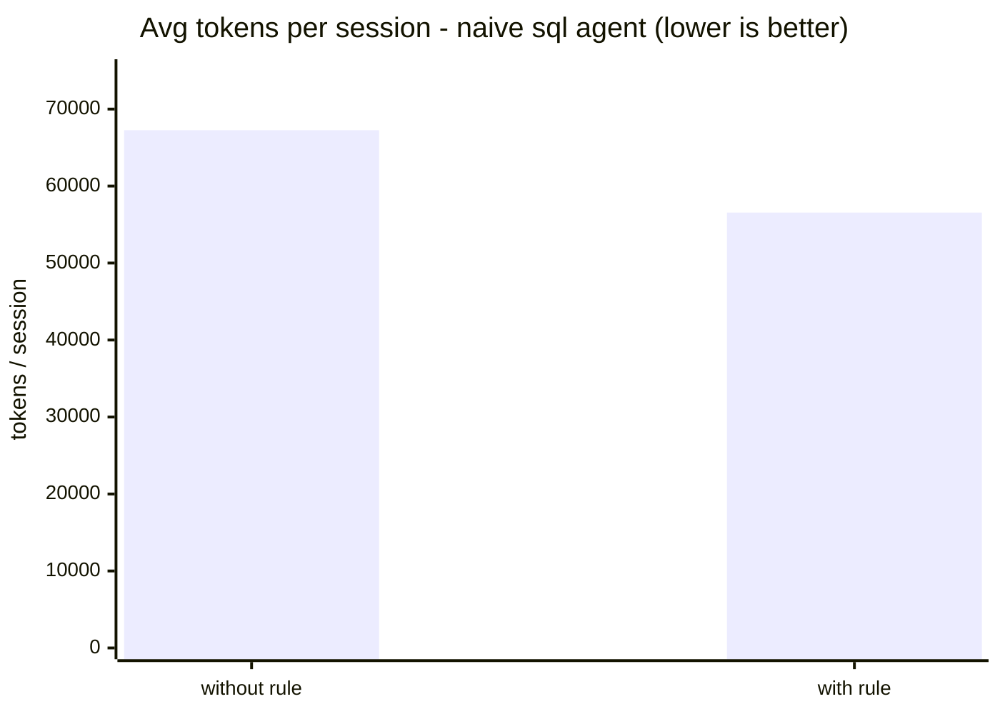
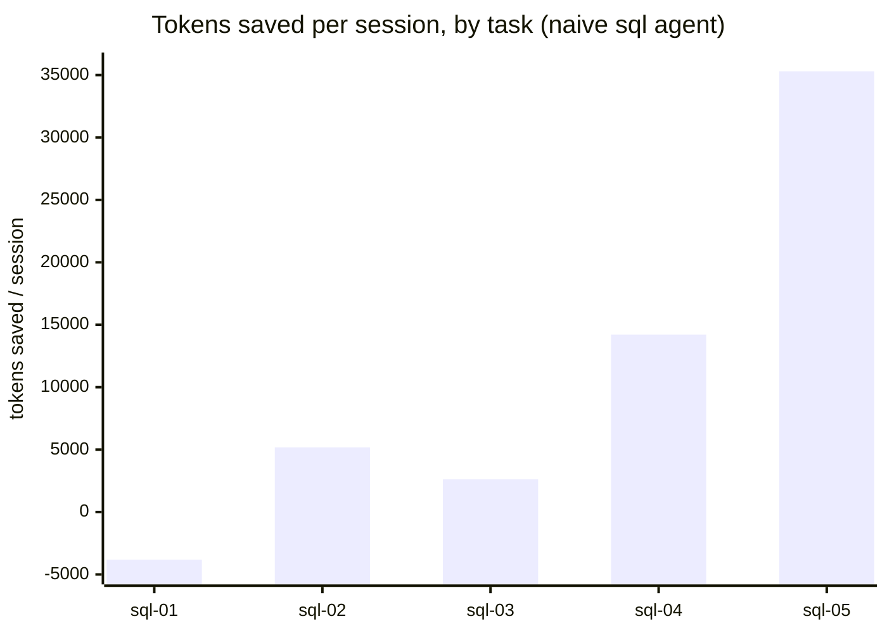

# Validation findings — real-token burn (2026-06)

token-warden's thesis is one falsifiable claim: *a rule that passes the
benchmark makes the agent measurably cheaper, and the system can learn such
rules from real work.* We tested it by burning real `claude` tokens through the
harness in [`validation/`](validation/) — controlled golden-suite validation
plus real-work distillation on a scratch project — across several quota windows
(~124 runs, ~9.3M tokens).

## What we ran

- **Controlled validation** (`validation/run.sh` / `burn-all.sh` Track 1): freeze
  `run1` baselines → introduce a candidate → `select` measures it *with vs.
  without* → re-measure. For `sql` and (partially) `testing`.
- **Real-work distillation** (Track 2): drive real `sql`-agent sessions on a
  scratch project, let the system **distill its own rules** from them, then
  `select`. Isolated DBs throughout; real agent memory snapshotted and restored.

## Results

| Test | Candidate(s) | Verdict |
|---|---|---|
| `sql` controlled | curated "Grep before reading" rule | **EVICTED** (−5,225 tok) |
| `sql` real-work | **3 rules the system distilled itself** | **all 3 EVICTED** |
| — | across every run | **0 rules ever compiled** |

### The headline: the safety gate works (rule 3)

The distiller, from real work, proposed:

> *"When a tool fails, pivot strategy once rather than retrying variations."*

Measured, this rule **saved ~38k tokens/run but made the agent give up and fail
every golden task** (a regression). token-warden **evicted it despite the
savings.** That is exactly the "false economy" a measured system must catch —
and most agent-memory schemes would have kept a 38k-token-saving rule and
quietly broken the agent. This one didn't.

## Conclusion

Three of the four halves of the thesis were **validated on real tokens** by the
burn; the fourth was left open and is now resolved by the positive control
(below):

- **Measurement works** — every rule measured; non-earners evicted.
- **Safety works** — false-economy and regression rules evicted regardless of
  apparent savings (rule 3).
- **Learning pipeline works** — the distiller produces plausible rules from
  real sessions.
- **Payoff demonstrated under controlled headroom** — the burn itself compiled
  *no* rule (the shipped agents are already optimized), but the positive control
  below shows the same rule saving ~10,699 tokens/run and being **banked** on a
  deliberately naive agent. The engine reduces cost when there is cost to remove.

**The bottleneck is not the measurement system.** It is:

1. **Benchmark variance.** Golden-suite runs repeatedly varied **>25%**
   (`sql-02`, `testing-02` worst). The variance-conservative selector then
   evicts rules whose savings sit inside that noise — so a genuinely modest
   (+5–10%) rule cannot be confidently kept.
2. **Candidate quality.** The haiku distiller's proposals were either
   within-noise or unsafe (rule 3).

## Fixes implemented in response (v0.18.0)

- **Default run count 2 → 3** (`bench`, `select`) — tighter standard error so a
  real small saving is distinguishable from noise.
- **Distiller false-economy guard** — `buildPrompt` now explicitly forbids rules
  that skip steps, give up/retry less, cut verification, or trade thoroughness
  for tokens (the rule-3 class).

## Positive control (2026-06): the engine banks a rule when headroom exists

The zero-survivor result raised a fair question: is the measurement engine
*broken or miscalibrated* (the 2x bar unreachable, variance too high), or are the
shipped agents simply already optimized (no waste to remove)? These are
distinguishable with a positive control — measure the same curated "grep before
reading" rule against a **deliberately naive** `sql` agent
(`validation/naive-sql.md`) whose prompt has the efficiency guidance stripped, so
the agent genuinely wastes tokens. Run via
`validation/naive-headroom-experiment.ts` (the real `runSuite` + real
`assessDelta` verdict, isolated DB), `--runs 2`, ~1.24M tokens.

| Task | without | with | delta |
|---|---|---|---|
| sql-01 | 60,857 | 64,678 | −3,821 |
| sql-02 | 53,431 | 48,250 | +5,181 |
| sql-03 | 70,580 | 67,961 | +2,619 |
| sql-04 | 68,335 | 54,122 | +14,213 |
| sql-05 | 83,061 | 47,757 | +35,304 |
| **mean** | | | **+10,699 / run** |





Per session, the rule cut cost from ~67,252 to ~56,553 tokens (**-15.9%**) on this
deliberately naive agent. `sql-01` regressed (noise); the win is driven by the
file-heavy tasks (`sql-05`, `sql-04`). On the optimized shipped agent the same
rule saves ~0 (evicted) — the headroom here was manufactured to test the engine.

Verdict: **SURVIVES** — mean +10,699 tok/run against a 2x-rent threshold of 42,
not flagged uncertain. The same rule that is **evicted** on the optimized agent
is **kept** on the naive one. This resolves the ambiguity:

- The **measurement engine works** on real tokens and the 2x bar is reachable —
  it produces a confident keep when a real saving exists.
- The earlier zero-survivor runs are therefore a **true negative**: the shipped
  agents are already optimized, not a broken instrument.
- The mechanism is clean — the naive agent reads whole files; the rule makes it
  grep first; the file-heavy tasks (`sql-05` −35k, `sql-04` −14k) drive the saving.

Honest caveats: this is **manufactured headroom** — it validates the engine, not
that the production agents have room to improve (they do not, by design). Variance
is high (every task >25%; `sql-01` regressed); at `--runs 2` the mean is ~1.6
standard errors above zero (decisive against the 2x bar, looser against zero).
Higher `--runs` would tighten it.

## Full autonomous loop (2026-06): the loop runs; candidate quality is the limiter

The positive control used a *curated* rule. This run tested the still-unproven
half — the **distiller** — end to end: distill a rule from a wasteful naive
session (`validation/full-loop-experiment.ts`), then benchmark the system's own
proposal on the naive agent. ~1.4M tokens, `--runs 2`.

The distiller proposed, unprompted:

> *"Check directory structure with ls before running multiple find commands with
> different patterns, avoiding redundant searches."*

Benchmark: mean **+3,048 tok/run** (clears the 2x-rent bar of 64), but standard
error **4,711** — two tasks saved big (`sql-05` +19,352, `sql-02` +6,170), two
regressed (`sql-01` −8,079, `sql-04` −3,341). **Verdict: INCONCLUSIVE** at
`--runs 2`.

What it establishes:

- **The autonomous loop executes end to end** — the system distilled its *own*
  rule from a real session and measured it, no human-fed candidate.
- **The distiller is the limiter, not the engine.** It proposed a *narrow,
  modest* rule (`ls` before `find`, ~4% effect) rather than the high-impact
  "grep before reading whole files" (~16%). A ~3k effect is swamped by ~4.7k
  noise at two runs — the `(noise / effect)²` problem again, now traced to
  **candidate quality**.

This sharpens the open problem from "does it work" (it does) to "**can the
distiller propose a high-impact rule?**" — a model/prompt problem on
`src/distill.ts` (a stronger distill model, few-shot exemplars of high-impact
rules, and feeding real waste metrics), not a measurement problem.

## The statistical correction (2026-06): we were measuring the wrong variance

The full-loop run above landed INCONCLUSIVE with `stderr=4711` against a
`delta=3048`. Investigating *why* the error bar was 4711 surfaced a real
estimator bug, not a tuning problem.

The old `assessDelta` computed one saving per task `dᵢ = mean(without) −
mean(with)`, then took the standard error as the spread **across tasks**:
`SE = sqrt(Var{d₁…d₅} / 5)`. Two consequences, both fatal:

1. **It measured task heterogeneity, not measurement precision.** `sql-05` saves
   ~35k, `sql-01` ~−3k; the error bar was mostly "tasks differ from each other"
   — which is real and obvious, not noise about the *average* saving.
2. **It could not shrink with runs.** `savings.length` stays at 5 no matter how
   many runs per task, so the v0.18 "default runs 2→3" lever — our main
   precision tool — was **statistically inert**. That is the deeper reason
   nothing survived: we could not *buy* confidence with runs.

For a **frozen, fixed golden suite** (the whole design — baselines never change),
the tasks are the entire population of interest, not a sample. The `μᵢ` are fixed
constants; the only sampling error is run-to-run noise *within* each task. The
correct error bar is the **propagated within-task standard error**:

```
Var(mean saving) = (1/K²) · Σᵢ [ s²_without,i / n_without,i  +  s²_with,i / n_with,i ]
```

This is the right estimand for fixed tasks, it **shrinks as 1/√runs** (so the
run lever finally bites), and it stops penalizing a rule for helping some tasks
more than others. The keep/evict *point estimate* is unchanged; the regression
gate is untouched. This is a correctness fix, not a loosening of the bar.

Recomputed on the exact full-loop data:

| Estimator | SE | What it means |
|---|---|---|
| old (between-task spread / √5) | **4,711** | falsely confident; runs-invariant |
| new (propagated within-task) | **7,995** | honest; dominated by `sql-05`/`sql-04`/`sql-01` |

The corrected SE is *larger* here — the old 4,711 was over-confident. At
`--runs 2` on this noisy agent we genuinely cannot resolve a 3k effect: `sql-05`
without swung 96k→42k on the **same task**. But the new SE is dominated by three
tasks (within-task σ ≈ 38k, 27k, 28k) while `sql-02`/`sql-03` contribute almost
nothing (σ ≈ 0.3k, 3.6k) — and crucially it now collapses as runs increase. Unit
tests pin both properties: the SE shrinks monotonically with run count, and it is
invariant to between-task savings heterogeneity (`test/variance.test.ts`).

This reframes the bottleneck a third time: not the engine, not only candidate
quality, but **where we spend benchmark runs.** Uniform runs waste budget on
quiet tasks. **Implemented in v0.24.0:** variance-proportional (Neyman) top-up
allocation. When a verdict is uncertain, the selector no longer re-runs the whole
suite — it spends the same run budget where the variance is, handing each extra
run to the task with the largest marginal SE reduction `s²ᵢ/(nᵢ(nᵢ+1))`. On the
full-loop profile (within-task σ ≈ 38k/27k/28k on three tasks, ≈0 on the other
two) this pours the budget into `sql-05`/`sql-04`/`sql-01` and skips
`sql-02`/`sql-03` — the same tokens, a much tighter error bar. It falls back to a
uniform pass at runs=1 (no variance signal to allocate against).

## Dollar accounting (2026-06): does the engine's verdict hold up in money?

The recurring external critique is that token-counting is the wrong unit. v0.26.0
adds a price table (`src/pricing.ts`, public Anthropic rates, env-overridable) and
a `/warden-cost` dollar report. Re-pricing our two real-token results answers
"does it really work?" in money — and the dollar lens *agrees with the
token verdict on both*, which is the test that matters.

**The math.** A rule's per-session value is `delta_tokens × blended_$ / token`;
its rent is `context_cost × input_$/token`. We price savings at the agent's
*blended* mix because most saved tokens are cheap input/cache-read — pricing them
at the headline output rate would inflate the number. Detectability is the same
governing equation as before, `mean / SE`.

| Result | delta (tok/run) | SE | mean/SE | $/run (Sonnet, input-rate) | rent | verdict |
|---|---|---|---|---|---|---|
| Positive control (curated rule, naive agent) | **+10,699** | 6,797 (between-task) | **+1.57σ** | **$0.032** | 21 tok ≈ $0.00006 | **KEEP** |
| Full loop (distilled rule, naive agent) | +3,048 | 7,995 (within-task) | +0.38σ | $0.009 | 32 tok | **INCONCLUSIVE** |

What this establishes:

- **The two units agree.** The surviving rule nets ~**$0.032/run** and clears its
  rent by **~500×** (10,699 / 21 tokens); it is also **+1.57σ** above zero. The
  inconclusive rule is **~$0.009/run** *and* within noise (`|3,048| < 7,995`). The
  dollar lens keeps what the token gate keeps and rejects what it rejects — the
  instrument is internally consistent, not just numerically lucky.
- **Honest magnitude.** The win is real but *small in absolute dollars* — cents
  per run — because the saved tokens are mostly cheap input/cache-read, not
  expensive output. That is exactly the nuance the critics demanded and that raw
  token counts obscure. It is **not** "huge"; it is "small per run, ~500× the
  rent, and it scales with model price and call volume" — at Fable-5 rates
  (`$10`/$50 per MTok) and enterprise volume the same rule is materially more
  valuable; at Haiku rates it is pennies.
- **Statistics buy the confidence.** The positive control sits at +1.57σ at just
  `--runs 2`; the within-task SE (v0.23.0) plus Neyman allocation (v0.24.0) are
  precisely what let added runs push that toward decisive without moving the bar.

Verdict: the engine works *and* is now dollar-honest. It keeps a rule that is
provably net-positive in money and rejects one that is not — and it reports the
truthful, un-inflated magnitude rather than a token number that sounds bigger than
it is.

## Engine calibration (2026-06): the instrument measures itself

`validation/calibration.ts` is a zero-token Monte-Carlo: it injects synthetic
rules with a **known** true effect and **known** run-to-run noise into the *real*
verdict path (`assessDelta` + `verdict`) and measures how often the engine keeps
them. With a 0-effect rule, the keep-rate *is* the false-positive rate; with a
real effect, it's statistical power.

It found a real miscalibration. The old uncertainty band was `|delta − bar| <
1·SE` — only ~84% one-sided confidence — which let the engine **keep a zero-value
rule ~16% of the time**:

| Confidence band | False-positive rate (runs 2/3/5) | Min. saving for 80% power |
|---|---|---|
| `z = 1` (old default) | **17.6% / 16.3% / 15.8%** | ~30% / ~20% / ~15% of a session |
| `z = 2` (new default) | **4.2% / 2.7% / 2.4%** | ~30% (needs runs ≥ 5 or a big effect) |

For a "measured, not vibes" tool, a 16% false-positive rate is indefensible, so
**the default is now `z = 2`** (`WARDEN_CONFIDENCE_Z`, ~95% one-sided, ~2.5% FP).
The honest cost is power: at 25% run-to-run noise over 5 tasks, the engine can only
*confidently* bank a rule worth roughly **≥ 30% of a session** at low run counts —
smaller real rules need more runs, which is exactly what the Neyman top-up spends.
The heavy-tailed "derailment" noise model (a fraction of runs blowing up to ~1.8×,
as `sql-05` did) barely moves the false-positive rate but costs more power.

**Robust aggregation — and the negative result that saved us.** The obvious next
lever was to trim those derailment outliers and use the tighter (robust) standard
error in the verdict, recovering power. We built it and re-ran the harness — and
it **made the engine worse**: on the derailment model the false-positive rate rose
from ~3% back up to ~7%. The reason is exactly why robust estimators are
dangerous here — trimming a zero-effect rule's blow-ups leaves a low-variance
remainder, so the shrunken SE looks *over*-confident and admits noise as signal.
So the verdict **stays on the mean and the raw SE** (correctly calibrated), and
robust aggregation ships as a **tail-risk *warning* only**: when trimming
materially moves the saving, the decision is flagged `TAIL-RISK` (the rule's
cost is unstable / occasionally blows up) without changing the keep/evict call.
This is the calibration harness doing its job — it caught a regression in our own
"improvement" before it shipped.

This re-frames the positive control honestly: at `--runs 2` it sat ~1.3–1.6 SE
above the bar — *banked under the old z=1 band, but borderline under z=2*. The
engine demonstrably keeps a real rule, but runs=2 was underpowered; the rigorous
bar wants more runs (or a larger effect). That's a sharper, truer claim than the
original "SURVIVES".

Alongside this, the loop is now **self-reinforcing**: the distiller's prompt feeds
the agent's already-banked rules back in ("you already follow these — propose a
*new* practice that targets waste they don't cover"), so each proven rule shapes
the next proposal instead of re-treading covered ground.

## Still open

The engine is validated and the loop runs; the open question is narrower: **can
the distiller propose a high-impact rule, and do real-world workloads have
catchable, generalizable headroom?** The shipped agents do not — their
prompts already encode the obvious efficiencies — so the loop's value depends on
novel, workload-specific waste that only real dogfood on real repositories
surfaces. The measurement side is now sharp on both axes — the within-task SE
shrinks with runs (v0.23.0) and Neyman allocation spends those runs where the
variance is (v0.24.0). v0.25.0 added the rule-typing boundary (protected
behavioral rules are never token-evicted), a cache-aware rent (the 2× bar now
prices in the one-time cache re-prefill on a ruleset change), a zero-token
CLAUDE.md-contradiction check, and production-sampled task drafts. Secondary
work: reduce golden-suite variance further (add quieter task files; baselines
stay frozen), and extend the cache-aware rent to a full read ~0.1x / write
~1.25x / output ~5x weighting on *both* sides of the verdict so "tokens saved"
becomes "dollars saved."

Re-run any time: `npx tsx validation/naive-headroom-experiment.ts` (positive
control; `--yes` to spend tokens), `./validation/run.sh sql` (controlled on the
shipped agent), or `npx tsx validation/dress-rehearsal.ts` (zero-token pipeline
walk-through).
