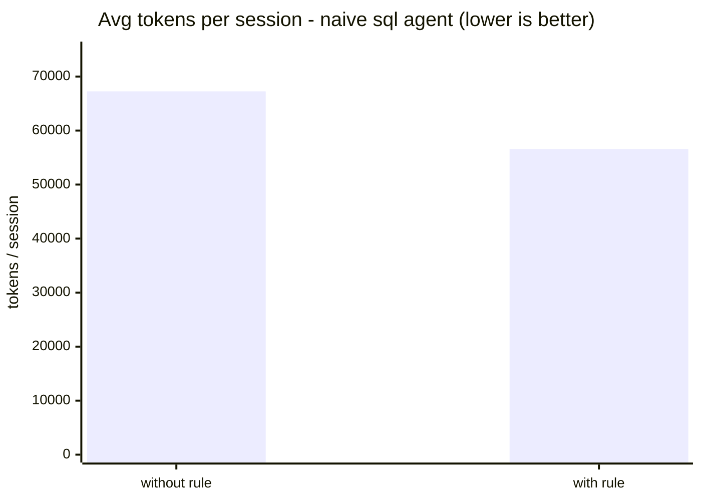
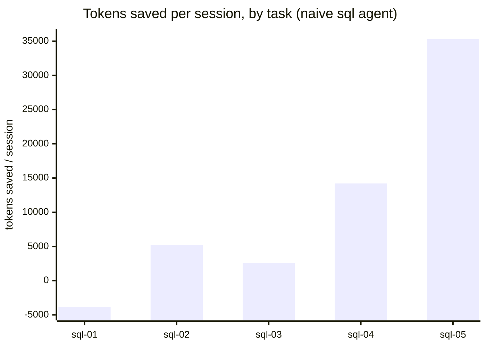

# Validation findings — real-token burn (2026-06)

token-warden's thesis is one falsifiable claim: *a rule that passes the
benchmark makes the agent measurably cheaper, and the system can learn such
rules from real work.* We tested it by burning real `claude` tokens through the
harness in [`validation/`](validation/) — controlled golden-suite validation
plus real-work distillation on a scratch project — across several quota windows
(~124 runs, ~9.3M tokens).

## What we ran

- **Controlled validation** (`validation/run.sh` / `burn-all.sh` Track 1): freeze
  `run1` baselines → introduce a candidate → `select` measures it *with vs.
  without* → re-measure. For `sql` and (partially) `testing`.
- **Real-work distillation** (Track 2): drive real `sql`-agent sessions on a
  scratch project, let the system **distill its own rules** from them, then
  `select`. Isolated DBs throughout; real agent memory snapshotted and restored.

## Results

| Test | Candidate(s) | Verdict |
|---|---|---|
| `sql` controlled | curated "Grep before reading" rule | **EVICTED** (−5,225 tok) |
| `sql` real-work | **3 rules the system distilled itself** | **all 3 EVICTED** |
| — | across every run | **0 rules ever compiled** |

### The headline: the safety gate works (rule 3)

The distiller, from real work, proposed:

> *"When a tool fails, pivot strategy once rather than retrying variations."*

Measured, this rule **saved ~38k tokens/run but made the agent give up and fail
every golden task** (a regression). token-warden **evicted it despite the
savings.** That is exactly the "false economy" a measured system must catch —
and most agent-memory schemes would have kept a 38k-token-saving rule and
quietly broken the agent. This one didn't.

## Conclusion

Three of the four halves of the thesis were **validated on real tokens** by the
burn; the fourth was left open and is now resolved by the positive control
(below):

- **Measurement works** — every rule measured; non-earners evicted.
- **Safety works** — false-economy and regression rules evicted regardless of
  apparent savings (rule 3).
- **Learning pipeline works** — the distiller produces plausible rules from
  real sessions.
- **Payoff demonstrated under controlled headroom** — the burn itself compiled
  *no* rule (the shipped agents are already optimized), but the positive control
  below shows the same rule saving ~10,699 tokens/run and being **banked** on a
  deliberately naive agent. The engine reduces cost when there is cost to remove.

**The bottleneck is not the measurement system.** It is:

1. **Benchmark variance.** Golden-suite runs repeatedly varied **>25%**
   (`sql-02`, `testing-02` worst). The variance-conservative selector then
   evicts rules whose savings sit inside that noise — so a genuinely modest
   (+5–10%) rule cannot be confidently kept.
2. **Candidate quality.** The haiku distiller's proposals were either
   within-noise or unsafe (rule 3).

## Fixes implemented in response (v0.18.0)

- **Default run count 2 → 3** (`bench`, `select`) — tighter standard error so a
  real small saving is distinguishable from noise.
- **Distiller false-economy guard** — `buildPrompt` now explicitly forbids rules
  that skip steps, give up/retry less, cut verification, or trade thoroughness
  for tokens (the rule-3 class).

## Positive control (2026-06): the engine banks a rule when headroom exists

The zero-survivor result raised a fair question: is the measurement engine
*broken or miscalibrated* (the 2x bar unreachable, variance too high), or are the
shipped agents simply already optimized (no waste to remove)? These are
distinguishable with a positive control — measure the same curated "grep before
reading" rule against a **deliberately naive** `sql` agent
(`validation/naive-sql.md`) whose prompt has the efficiency guidance stripped, so
the agent genuinely wastes tokens. Run via
`validation/naive-headroom-experiment.ts` (the real `runSuite` + real
`assessDelta` verdict, isolated DB), `--runs 2`, ~1.24M tokens.

| Task | without | with | delta |
|---|---|---|---|
| sql-01 | 60,857 | 64,678 | −3,821 |
| sql-02 | 53,431 | 48,250 | +5,181 |
| sql-03 | 70,580 | 67,961 | +2,619 |
| sql-04 | 68,335 | 54,122 | +14,213 |
| sql-05 | 83,061 | 47,757 | +35,304 |
| **mean** | | | **+10,699 / run** |

Per session, the rule cut cost from ~67,252 to ~56,553 tokens (**-15.9%**) on this
deliberately naive agent. `sql-01` regressed (noise); the win is driven by the
file-heavy tasks (`sql-05`, `sql-04`). On the optimized shipped agent the same
rule saves ~0 (evicted) — the headroom here was manufactured to test the engine.

Verdict: **SURVIVES** — mean +10,699 tok/run against a 2x-rent threshold of 42,
not flagged uncertain. The same rule that is **evicted** on the optimized agent
is **kept** on the naive one. This resolves the ambiguity:

- The **measurement engine works** on real tokens and the 2x bar is reachable —
  it produces a confident keep when a real saving exists.
- The earlier zero-survivor runs are therefore a **true negative**: the shipped
  agents are already optimized, not a broken instrument.
- The mechanism is clean — the naive agent reads whole files; the rule makes it
  grep first; the file-heavy tasks (`sql-05` −35k, `sql-04` −14k) drive the saving.

Honest caveats: this is **manufactured headroom** — it validates the engine, not
that the production agents have room to improve (they do not, by design). Variance
is high (every task >25%; `sql-01` regressed); at `--runs 2` the mean is ~1.6
standard errors above zero (decisive against the 2x bar, looser against zero).
Higher `--runs` would tighten it.

## Full autonomous loop (2026-06): the loop runs; candidate quality is the limiter

The positive control used a *curated* rule. This run tested the still-unproven
half — the **distiller** — end to end: distill a rule from a wasteful naive
session (`validation/full-loop-experiment.ts`), then benchmark the system's own
proposal on the naive agent. ~1.4M tokens, `--runs 2`.

The distiller proposed, unprompted:

> *"Check directory structure with ls before running multiple find commands with
> different patterns, avoiding redundant searches."*

Benchmark: mean **+3,048 tok/run** (clears the 2x-rent bar of 64), but standard
error **4,711** — two tasks saved big (`sql-05` +19,352, `sql-02` +6,170), two
regressed (`sql-01` −8,079, `sql-04` −3,341). **Verdict: INCONCLUSIVE** at
`--runs 2`.

What it establishes:

- **The autonomous loop executes end to end** — the system distilled its *own*
  rule from a real session and measured it, no human-fed candidate.
- **The distiller is the limiter, not the engine.** It proposed a *narrow,
  modest* rule (`ls` before `find`, ~4% effect) rather than the high-impact
  "grep before reading whole files" (~16%). A ~3k effect is swamped by ~4.7k
  noise at two runs — the `(noise / effect)²` problem again, now traced to
  **candidate quality**.

This sharpens the open problem from "does it work" (it does) to "**can the
distiller propose a high-impact rule?**" — a model/prompt problem on
`src/distill.ts` (a stronger distill model, few-shot exemplars of high-impact
rules, and feeding real waste metrics), not a measurement problem.

## Still open

The engine is validated and the loop runs; the open question is narrower: **can
the distiller propose a high-impact rule, and do real-world workloads have
catchable, generalizable headroom?** The shipped agents do not — their
prompts already encode the obvious efficiencies — so the loop's value depends on
novel, workload-specific waste that only real dogfood on real repositories
surfaces. Secondary work: reduce golden-suite variance further (add quieter task
files; baselines stay frozen), and fold cache-weighted cost (read ~0.1x, write
~1.25x, output ~5x) into the verdict so "tokens saved" becomes "dollars saved."

Re-run any time: `npx tsx validation/naive-headroom-experiment.ts` (positive
control; `--yes` to spend tokens), `./validation/run.sh sql` (controlled on the
shipped agent), or `npx tsx validation/dress-rehearsal.ts` (zero-token pipeline
walk-through).
