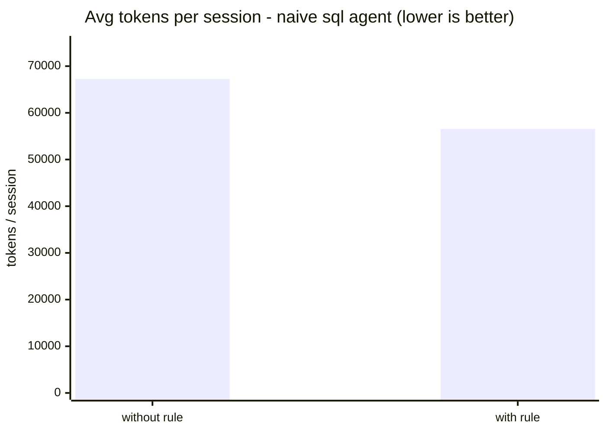
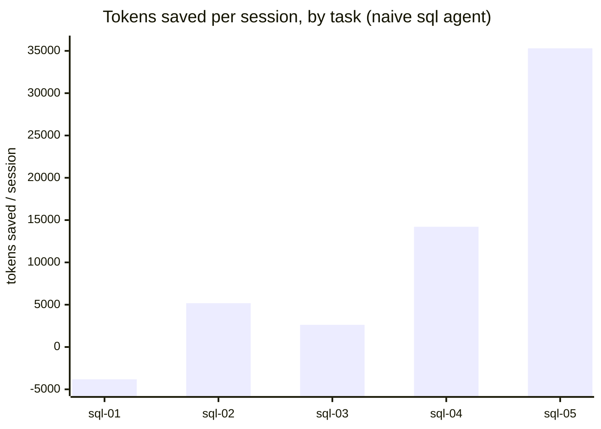

# Validation findings — real-token burn (2026-06)

token-warden's thesis is one falsifiable claim: *a rule that passes the
benchmark makes the agent measurably cheaper, and the system can learn such
rules from real work.* We tested it by burning real `claude` tokens through the
harness in [`validation/`](validation/) — controlled golden-suite validation
plus real-work distillation on a scratch project — across several quota windows
(~124 runs, ~9.3M tokens).

## What we ran

- **Controlled validation** (`validation/run.sh` / `burn-all.sh` Track 1): freeze
  `run1` baselines → introduce a candidate → `select` measures it *with vs.
  without* → re-measure. For `sql` and (partially) `testing`.
- **Real-work distillation** (Track 2): drive real `sql`-agent sessions on a
  scratch project, let the system **distill its own rules** from them, then
  `select`. Isolated DBs throughout; real agent memory snapshotted and restored.

## Results

| Test | Candidate(s) | Verdict |
|---|---|---|
| `sql` controlled | curated "Grep before reading" rule | **EVICTED** (−5,225 tok) |
| `sql` real-work | **3 rules the system distilled itself** | **all 3 EVICTED** |
| — | across every run | **0 rules ever compiled** |

### The headline: the safety gate works (rule 3)

The distiller, from real work, proposed:

> *"When a tool fails, pivot strategy once rather than retrying variations."*

Measured, this rule **saved ~38k tokens/run but made the agent give up and fail
every golden task** (a regression). token-warden **evicted it despite the
savings.** That is exactly the "false economy" a measured system must catch —
and most agent-memory schemes would have kept a 38k-token-saving rule and
quietly broken the agent. This one didn't.

## Conclusion

Three of the four halves of the thesis were **validated on real tokens** by the
burn; the fourth was left open and is now resolved by the positive control
(below):

- **Measurement works** — every rule measured; non-earners evicted.
- **Safety works** — false-economy and regression rules evicted regardless of
  apparent savings (rule 3).
- **Learning pipeline works** — the distiller produces plausible rules from
  real sessions.
- **Payoff demonstrated under controlled headroom** — the burn itself compiled
  *no* rule (the shipped agents are already optimized), but the positive control
  below shows the same rule saving ~10,699 tokens/run and being **banked** on a
  deliberately naive agent. The engine reduces cost when there is cost to remove.

**The bottleneck is not the measurement system.** It is:

1. **Benchmark variance.** Golden-suite runs repeatedly varied **>25%**
   (`sql-02`, `testing-02` worst). The variance-conservative selector then
   evicts rules whose savings sit inside that noise — so a genuinely modest
   (+5–10%) rule cannot be confidently kept.
2. **Candidate quality.** The haiku distiller's proposals were either
   within-noise or unsafe (rule 3).

## Fixes implemented in response (v0.18.0)

- **Default run count 2 → 3** (`bench`, `select`) — tighter standard error so a
  real small saving is distinguishable from noise.
- **Distiller false-economy guard** — `buildPrompt` now explicitly forbids rules
  that skip steps, give up/retry less, cut verification, or trade thoroughness
  for tokens (the rule-3 class).

## Positive control (2026-06): the engine banks a rule when headroom exists

The zero-survivor result raised a fair question: is the measurement engine
*broken or miscalibrated* (the 2x bar unreachable, variance too high), or are the
shipped agents simply already optimized (no waste to remove)? These are
distinguishable with a positive control — measure the same curated "grep before
reading" rule against a **deliberately naive** `sql` agent
(`validation/naive-sql.md`) whose prompt has the efficiency guidance stripped, so
the agent genuinely wastes tokens. Run via
`validation/naive-headroom-experiment.ts` (the real `runSuite` + real
`assessDelta` verdict, isolated DB), `--runs 2`, ~1.24M tokens.

| Task | without | with | delta |
|---|---|---|---|
| sql-01 | 60,857 | 64,678 | −3,821 |
| sql-02 | 53,431 | 48,250 | +5,181 |
| sql-03 | 70,580 | 67,961 | +2,619 |
| sql-04 | 68,335 | 54,122 | +14,213 |
| sql-05 | 83,061 | 47,757 | +35,304 |
| **mean** | | | **+10,699 / run** |


```mermaid
xychart-beta
    title "Avg tokens per session - naive sql agent (lower is better)"
    x-axis ["without rule", "with rule"]
    y-axis "tokens / session" 0 --> 75000
    bar [67252, 56553]
```


```mermaid
xychart-beta
    title "Tokens saved per session, by task (naive sql agent)"
    x-axis ["sql-01", "sql-02", "sql-03", "sql-04", "sql-05"]
    y-axis "tokens saved / session" -5000 --> 36000
    bar [-3821, 5181, 2619, 14213, 35304]
```

Per session, the rule cut cost from ~67,252 to ~56,553 tokens (**-15.9%**) on this
deliberately naive agent. `sql-01` regressed (noise); the win is driven by the
file-heavy tasks (`sql-05`, `sql-04`). On the optimized shipped agent the same
rule saves ~0 (evicted) — the headroom here was manufactured to test the engine.

Verdict: **SURVIVES** — mean +10,699 tok/run against a 2x-rent threshold of 42,
not flagged uncertain. The same rule that is **evicted** on the optimized agent
is **kept** on the naive one. This resolves the ambiguity:

- The **measurement engine works** on real tokens and the 2x bar is reachable —
  it produces a confident keep when a real saving exists.
- The earlier zero-survivor runs are therefore a **true negative**: the shipped
  agents are already optimized, not a broken instrument.
- The mechanism is clean — the naive agent reads whole files; the rule makes it
  grep first; the file-heavy tasks (`sql-05` −35k, `sql-04` −14k) drive the saving.

Honest caveats: this is **manufactured headroom** — it validates the engine, not
that the production agents have room to improve (they do not, by design). Variance
is high (every task >25%; `sql-01` regressed); at `--runs 2` the mean is ~1.6
standard errors above zero (decisive against the 2x bar, looser against zero).
Higher `--runs` would tighten it.

## Full autonomous loop (2026-06): the loop runs; candidate quality is the limiter

The positive control used a *curated* rule. This run tested the still-unproven
half — the **distiller** — end to end: distill a rule from a wasteful naive
session (`validation/full-loop-experiment.ts`), then benchmark the system's own
proposal on the naive agent. ~1.4M tokens, `--runs 2`.

The distiller proposed, unprompted:

> *"Check directory structure with ls before running multiple find commands with
> different patterns, avoiding redundant searches."*

Benchmark: mean **+3,048 tok/run** (clears the 2x-rent bar of 64), but standard
error **4,711** — two tasks saved big (`sql-05` +19,352, `sql-02` +6,170), two
regressed (`sql-01` −8,079, `sql-04` −3,341). **Verdict: INCONCLUSIVE** at
`--runs 2`.

What it establishes:

- **The autonomous loop executes end to end** — the system distilled its *own*
  rule from a real session and measured it, no human-fed candidate.
- **The distiller is the limiter, not the engine.** It proposed a *narrow,
  modest* rule (`ls` before `find`, ~4% effect) rather than the high-impact
  "grep before reading whole files" (~16%). A ~3k effect is swamped by ~4.7k
  noise at two runs — the `(noise / effect)²` problem again, now traced to
  **candidate quality**.

This sharpens the open problem from "does it work" (it does) to "**can the
distiller propose a high-impact rule?**" — a model/prompt problem on
`src/distill.ts` (a stronger distill model, few-shot exemplars of high-impact
rules, and feeding real waste metrics), not a measurement problem.

## The statistical correction (2026-06): we were measuring the wrong variance

The full-loop run above landed INCONCLUSIVE with `stderr=4711` against a
`delta=3048`. Investigating *why* the error bar was 4711 surfaced a real
estimator bug, not a tuning problem.

The old `assessDelta` computed one saving per task `dᵢ = mean(without) −
mean(with)`, then took the standard error as the spread **across tasks**:
`SE = sqrt(Var{d₁…d₅} / 5)`. Two consequences, both fatal:

1. **It measured task heterogeneity, not measurement precision.** `sql-05` saves
   ~35k, `sql-01` ~−3k; the error bar was mostly "tasks differ from each other"
   — which is real and obvious, not noise about the *average* saving.
2. **It could not shrink with runs.** `savings.length` stays at 5 no matter how
   many runs per task, so the v0.18 "default runs 2→3" lever — our main
   precision tool — was **statistically inert**. That is the deeper reason
   nothing survived: we could not *buy* confidence with runs.

For a **frozen, fixed golden suite** (the whole design — baselines never change),
the tasks are the entire population of interest, not a sample. The `μᵢ` are fixed
constants; the only sampling error is run-to-run noise *within* each task. The
correct error bar is the **propagated within-task standard error**:

```
Var(mean saving) = (1/K²) · Σᵢ [ s²_without,i / n_without,i  +  s²_with,i / n_with,i ]
```

This is the right estimand for fixed tasks, it **shrinks as 1/√runs** (so the
run lever finally bites), and it stops penalizing a rule for helping some tasks
more than others. The keep/evict *point estimate* is unchanged; the regression
gate is untouched. This is a correctness fix, not a loosening of the bar.

Recomputed on the exact full-loop data:

| Estimator | SE | What it means |
|---|---|---|
| old (between-task spread / √5) | **4,711** | falsely confident; runs-invariant |
| new (propagated within-task) | **7,995** | honest; dominated by `sql-05`/`sql-04`/`sql-01` |

The corrected SE is *larger* here — the old 4,711 was over-confident. At
`--runs 2` on this noisy agent we genuinely cannot resolve a 3k effect: `sql-05`
without swung 96k→42k on the **same task**. But the new SE is dominated by three
tasks (within-task σ ≈ 38k, 27k, 28k) while `sql-02`/`sql-03` contribute almost
nothing (σ ≈ 0.3k, 3.6k) — and crucially it now collapses as runs increase. Unit
tests pin both properties: the SE shrinks monotonically with run count, and it is
invariant to between-task savings heterogeneity (`test/variance.test.ts`).

This reframes the bottleneck a third time: not the engine, not only candidate
quality, but **where we spend benchmark runs.** Uniform runs waste budget on
quiet tasks. **Implemented in v0.24.0:** variance-proportional (Neyman) top-up
allocation. When a verdict is uncertain, the selector no longer re-runs the whole
suite — it spends the same run budget where the variance is, handing each extra
run to the task with the largest marginal SE reduction `s²ᵢ/(nᵢ(nᵢ+1))`. On the
full-loop profile (within-task σ ≈ 38k/27k/28k on three tasks, ≈0 on the other
two) this pours the budget into `sql-05`/`sql-04`/`sql-01` and skips
`sql-02`/`sql-03` — the same tokens, a much tighter error bar. It falls back to a
uniform pass at runs=1 (no variance signal to allocate against).

## Dollar accounting (2026-06): does the engine's verdict hold up in money?

The recurring external critique is that token-counting is the wrong unit. v0.26.0
adds a price table (`src/pricing.ts`, public Anthropic rates, env-overridable) and
a `/warden-cost` dollar report. Re-pricing our two real-token results answers
"does it really work?" in money — and the dollar lens *agrees with the
token verdict on both*, which is the test that matters.

**The math.** A rule's per-session value is `delta_tokens × blended_$ / token`;
its rent is `context_cost × input_$/token`. We price savings at the agent's
*blended* mix because most saved tokens are cheap input/cache-read — pricing them
at the headline output rate would inflate the number. Detectability is the same
governing equation as before, `mean / SE`.

| Result | delta (tok/run) | SE | mean/SE | $/run (Sonnet, input-rate) | rent | verdict |
|---|---|---|---|---|---|---|
| Positive control (curated rule, naive agent) | **+10,699** | 6,797 (between-task) | **+1.57σ** | **$0.032** | 21 tok ≈ $0.00006 | **KEEP** |
| Full loop (distilled rule, naive agent) | +3,048 | 7,995 (within-task) | +0.38σ | $0.009 | 32 tok | **INCONCLUSIVE** |

What this establishes:

- **The two units agree.** The surviving rule nets ~**$0.032/run** and clears its
  rent by **~500×** (10,699 / 21 tokens); it is also **+1.57σ** above zero. The
  inconclusive rule is **~$0.009/run** *and* within noise (`|3,048| < 7,995`). The
  dollar lens keeps what the token gate keeps and rejects what it rejects — the
  instrument is internally consistent, not just numerically lucky.
- **Honest magnitude.** The win is real but *small in absolute dollars* — cents
  per run — because the saved tokens are mostly cheap input/cache-read, not
  expensive output. That is exactly the nuance the critics demanded and that raw
  token counts obscure. It is **not** "huge"; it is "small per run, ~500× the
  rent, and it scales with model price and call volume" — at Fable-5 rates
  (`$10`/$50 per MTok) and enterprise volume the same rule is materially more
  valuable; at Haiku rates it is pennies.
- **Statistics buy the confidence.** The positive control sits at +1.57σ at just
  `--runs 2`; the within-task SE (v0.23.0) plus Neyman allocation (v0.24.0) are
  precisely what let added runs push that toward decisive without moving the bar.

Verdict: the engine works *and* is now dollar-honest. It keeps a rule that is
provably net-positive in money and rejects one that is not — and it reports the
truthful, un-inflated magnitude rather than a token number that sounds bigger than
it is.

## Engine calibration (2026-06): the instrument measures itself

`validation/calibration.ts` is a zero-token Monte-Carlo: it injects synthetic
rules with a **known** true effect and **known** run-to-run noise into the *real*
verdict path (`assessDelta` + `verdict`) and measures how often the engine keeps
them. With a 0-effect rule, the keep-rate *is* the false-positive rate; with a
real effect, it's statistical power.

It found a real miscalibration. The old uncertainty band was `|delta − bar| <
1·SE` — only ~84% one-sided confidence — which let the engine **keep a zero-value
rule ~16% of the time**:

| Confidence band | False-positive rate (runs 2/3/5) | Min. saving for 80% power |
|---|---|---|
| `z = 1` (old default) | **17.6% / 16.3% / 15.8%** | ~30% / ~20% / ~15% of a session |
| `z = 2` (new default) | **4.2% / 2.7% / 2.4%** | ~30% (needs runs ≥ 5 or a big effect) |

For a "measured, not vibes" tool, a 16% false-positive rate is indefensible, so
**the default is now `z = 2`** (`WARDEN_CONFIDENCE_Z`, ~95% one-sided, ~2.5% FP).
The honest cost is power: at 25% run-to-run noise over 5 tasks, the engine can only
*confidently* bank a rule worth roughly **≥ 30% of a session** at low run counts —
smaller real rules need more runs, which is exactly what the Neyman top-up spends.
The heavy-tailed "derailment" noise model (a fraction of runs blowing up to ~1.8×,
as `sql-05` did) barely moves the false-positive rate but costs more power.

**Robust aggregation — and the negative result that saved us.** The obvious next
lever was to trim those derailment outliers and use the tighter (robust) standard
error in the verdict, recovering power. We built it and re-ran the harness — and
it **made the engine worse**: on the derailment model the false-positive rate rose
from ~3% back up to ~7%. The reason is exactly why robust estimators are
dangerous here — trimming a zero-effect rule's blow-ups leaves a low-variance
remainder, so the shrunken SE looks *over*-confident and admits noise as signal.
So the verdict **stays on the mean and the raw SE** (correctly calibrated), and
robust aggregation ships as a **tail-risk *warning* only**: when trimming
materially moves the saving, the decision is flagged `TAIL-RISK` (the rule's
cost is unstable / occasionally blows up) without changing the keep/evict call.
This is the calibration harness doing its job — it caught a regression in our own
"improvement" before it shipped.

This re-frames the positive control honestly: at `--runs 2` it sat ~1.3–1.6 SE
above the bar — *banked under the old z=1 band, but borderline under z=2*. The
engine demonstrably keeps a real rule, but runs=2 was underpowered; the rigorous
bar wants more runs (or a larger effect). That's a sharper, truer claim than the
original "SURVIVES".

Alongside this, the loop is now **self-reinforcing**: the distiller's prompt feeds
the agent's already-banked rules back in ("you already follow these — propose a
*new* practice that targets waste they don't cover"), so each proven rule shapes
the next proposal instead of re-treading covered ground.

## Re-audit churn (2026-07): the harness validates a feature this time

The July 2026 repository audit ([docs/audit-2026-07.md](docs/audit-2026-07.md))
found the retention policy statistically inconsistent with the admission policy.
A candidate must clear the bar by `z·SE` to be admitted, but an active rule was
evicted whenever a single re-audit *point estimate* landed below the bar — and
since the bar (~2× rent, tens of tokens) is tiny next to the SE (thousands),
regression to the mean made every re-audit of a genuine earner a lottery ticket
against it. This is not hypothetical: the live database's Grep rule, admitted at
+3,673, was evicted by one −9,215 re-audit draw (recorded in the README's
demonstration section as an honest variance illustration — it was actually a
policy bug).

The same Monte-Carlo harness that vetoed robust aggregation (above) was extended
with a churn model, and this time the result was positive. Per-cycle
sub-threshold probability, measured through the real `assessDelta` + `verdict`
path, with expected active lifetimes (gaussian noise, runs=3):

| true effect | P(sub-threshold)/cycle | one-strike lifetime | two-strike lifetime |
|---|---|---|---|
| 0 (dead rule) | 50.7% | 2.0 cycles | 5.9 cycles |
| 3,000 tok/run | 29.9% | 3.3 cycles | 14.5 cycles |
| 6,000 tok/run | 13.7% | 7.3 cycles | 61.0 cycles |
| 12,000 tok/run | 1.6% | 63.5 cycles | 4,094.7 cycles |

So retention is now **two-strike**: the first non-regression sub-threshold
re-audit puts the rule on probation (kept, flagged); a second *consecutive* one
evicts; a passing re-audit clears the strike. A regression still evicts
immediately. Keep-when-uncertain was considered and rejected — because rent <<
SE, a dead rule is *permanently* "uncertain" relative to the bar and would never
leave. The asymmetry above is the finding: a dead rule pays ~25 tokens/session
for ~4 extra cycles, while a real earner stops being churned out by single noisy
draws.

## Empirical calibration (2026-07): the gate measured against its own recorded noise

Every calibration number so far came from a synthetic noise model (Gaussian +
derailment, sigma ~25%, parameters eyeballed from a few runs). v0.35.0's
`validation/empirical-calibration.ts` removes the assumption: it resamples the
RECORDED active-set golden runs — replicate groups keyed by (task, ruleset
version, model), so every group is repeated measurements of an identical
configuration — and pushes fake with/without splits through the real
`assessDelta` + `verdict` + top-up pipeline. Both sides of a split come from
the same pool, so the true delta is zero by construction and the keep rate IS
the false-positive rate, distribution-free.

First run against the live database (sql agent, the only one with enough
replicate history: 3 tasks x 4-5 runs at one ruleset version, runs=2/side):

| measurement | result |
|---|---|
| permutation A/A false-positive rate | **8.8% [7.9%, 9.7%]** (4,000 trials) |
| bootstrap A/A false-positive rate | 10.9% [10.0%, 11.9%] |
| power at a 10% injected saving (4,724 tok) | 34.7% |
| power at a 20% injected saving (9,448 tok) | 69.8% |

The synthetic harness claims ~4% FP at these settings (z=2, runs=2). The
empirical rate is **2-3x higher**: real recorded noise is heavier-tailed /
more structured than the model. Honest read of the gate today: at z=2 and
runs=2 it delivers ~91% specificity on real data, not ~96%. Caveats, stated
plainly: the pool is small (13 runs across 3 tasks — one sample of history,
and the Wilson CIs cover Monte-Carlo error only), and trial top-ups draw from
thin held-out remainders. The remedy is built in: every selector invocation
adds runs=3 of fresh active-set replicates per task, so this measurement
sharpens with normal use — re-run it before trusting any marginal verdict.

`/warden-power` (same release) turns the recorded variances into planning
numbers. For sql today: minimum detectable saving at the default 3 runs/side
is **~12,330 tok/run at 80% power** (~14,230 at 90%); a 10%-of-session rule
(4,724 tok) needs **21 runs/side** at 80% power. Conservative by design
(uniform allocation — the Neyman top-up only tightens). The practical
consequence for the dogfood plan: expect the fixture gate to bank only
large-effect rules at default run counts; budget runs with /warden-power
before a verification burn instead of discovering "inconclusive" after it.

## Two calibration verdicts (2026-07): a policy rejected, a feature deferred

v0.36.0 put two candidate changes through the simulation harness before the
gate. Both were held back — the point of the harness.

**Confidence-sequence retention loses to two-strike.** An anytime-valid
confidence sequence (Howard et al. 2021) evicts when the time-uniform upper
bound `UCB_t = mean_t + u(t)` drops below the 2x-rent bar. Against a
pre-declared criterion (dead rule exits within 8 cycles AND earners live at
least as long as under two-strike), it fails decisively:

| effect | two-strike life | conf-seq life |
|---|---|---|
| 0 (dead) | 5.9 cyc | ~492 cyc |
| 6,000 tok | 61 cyc | > 500 cyc |

The binding constraint is not the CS theory but the bar/SE ratio: with a
per-audit SE of ~5,500-7,900 tokens against a ~54-token bar, `u(t)` needs on
the order of (SE/bar)^2 ~ 10^4 audits to shrink below the bar, so a dead rule
essentially never exits. Two-strike stays. alpha/rho were fixed before the run
and not tuned to force a win.

**Distribution weighting inflates the false-positive rate at low run counts.**
The weighted estimators are provably the exact propagation of per-task noise
through the weighted mean, and bit-identical to the current gate when all
weights are 1. But an A/A check with weights [4,1,1,1,1] shows the gate
under-protecting:

| runs/side | unweighted FP | weighted FP |
|---|---|---|
| 2 | 4.2% | 6.5% |
| 3 | 2.7% | 4.0% |
| 5 | 2.4% | 3.1% |

This is correct statistics, not a bug: concentrating weights drops the Kish
effective sample size (5 tasks -> ~3.2 here), so the SE is estimated from fewer
effective degrees of freedom and a flat z=2 threshold is too loose.

**Resolution (v0.37.0): the effective-DoF correction closes it.** The confidence
multiple is now widened by the ratio of small-sample t-inflations (Cornish-Fisher
`t_df ≈ z(1 + (z²+1)/(4df))`) at the actual effective DoF vs the uniform-weight
DoF — Welch-Satterthwaite within-task, Kish between-task. It is exactly 1 at
uniform weights (bit-identical) and clamped to never loosen the gate below z.
After the correction:

| runs/side | unweighted FP | weighted FP (corrected) |
|---|---|---|
| 2 | 4.2% | 5.3% |
| 3 | 2.7% | 3.4% |
| 5 | 2.4% | 2.8% |

Within ~0.7 points of unweighted at the default runs=3 and above; the ~1-point
residual at runs=2 is the inherent limit of estimating variance from two runs
(the correction assumes the DoF is known, which two runs barely support), a
regime `/warden-power` already flags as underpowered. Weighting is now a gate
input — reached, as with everything else, only after the harness said it was
safe.

## First compression A/B burn (2026-07-08): inconclusive, and honestly so

The first real-token run of `/warden-compress`. sql rule #4 ("Parse task
descriptions for technical direction...", rent 28, measured +5,731 tok/run) was
compressed to candidate #5 ("Use task direction; verify schema/deps only if
unclear", rent 14 — half). The selector measured #5 as a **swap** (active set
with #5 instead of #4) at 8 runs/side across the now-7-task sql suite: 168 runs,
~1 hour, ~13M tokens.

Verdict: **EVICTED — "uncertain after top-up"**, and the receipt is the whole
story:

- Point estimate: **saved 10,851 tok/run** (nearly 2x rule #4's original saving,
  at HALF the rent), **7/7 tasks still passing** (no regression), tool calls
  8 -> 7. On its face, compression didn't just preserve the saving — it looked
  like a big win.
- But **SE ±7,814**. The sql suite is savagely noisy (single runs ranged
  34k-256k tokens), so even 8 runs/side left the lower confidence bound *below*
  the 2x-rent bar. The gate could not confidently say the rule clears the bar,
  so it declined to promote — the "measured, not vibes" discipline refusing to
  bank a rule it can't prove, even one whose point estimate is 775x rent.

Two compounding causes, both worth recording:

1. **The suite is far noisier than the planner knew.** `/warden-power` had sized
   the burn (8 runs/side "well-powered") from the only variance history it had —
   the 3 old, quieter sql tasks (13 recorded active runs). The real 7-task suite,
   including 4 brand-new tasks, is much noisier; the measured SE (7,814) was ~3x
   the planner's estimate (2,645 at 8 runs). Lesson: the power planner is only as
   good as its variance history, and a suite that just grew is under-characterized.
   The swap-only path (no re-audit, rules protected) also records nothing under
   `config='active'`, so this burn did NOT improve the planner's history — the
   next plan is still blind to the new tasks' variance.
2. **The top-up ran out of quota.** Because the verdict was uncertain, the
   selector spent a Neyman top-up pass — and partway through it the user's Claude
   quota was exhausted: **46 consecutive `FAILED-CHECK` (0-token) runs**. The
   pre-flight probe confirmed quota was live at the *start*, but a 168-run,
   hour-long burn drained it by the top-up phase. Those failures contaminated the
   merged estimate (COMPLETION-DROP + TAIL-RISK flags) instead of tightening it.

What this is and isn't: it is **not** evidence that compression fails — the point
estimate is strongly positive and no task regressed. It is an **inconclusive**
result caused by (a) genuine suite variance that 8 runs/side can't see through and
(b) a quota-contaminated top-up. The correct read is that the gate behaved exactly
as designed: it will not promote on uncertain, contaminated evidence.

Follow-ups this surfaced: (i) cut sql-suite variance (the task-splitting work) so
a confirmatory burn is affordable — at this noise, confirming a real saving needs
many more runs than the planner's stale estimate implied; (ii) a selector guard
that treats an all-or-mostly-failed config pass as an environment failure and
aborts rather than finalizing a contaminated verdict; (iii) re-queue #5 (via
`/warden-compress` again) and re-run on a fresh full window once (i) lands.

**Run 2 (2026-07-09) — same wall, confirmed.** Re-queued the identical rule (as
candidate #6) and re-ran with the top-up disabled (`--top-up 0`) to remove the
mechanism that contaminated run 1. It died the same way, earlier: at runs=12 the
burn is ~168 high-effort runs, and the user's Claude quota was exhausted about
two-thirds through the candidate side (sql-06). The entire baseline half then
collapsed — **72 of 84 baseline runs `FAILED-CHECK` (0 tokens)** — so the
comparison inverted into a meaningless −71,998 "delta" and #6 was evicted as
non-positive. Not a regression; a quota-death artifact (the baseline measurement
broke, not the rule). **The robust conclusion across both runs: this experiment
is blocked by the environment, not the statistics.** A ~13-15M-token, ~168-run
high-effort burn cannot complete inside the available quota window; the second
half reliably collapses. More runs make it worse (run 2 died earlier than run 1
precisely because runs=12 hit the ceiling sooner). The compression rule remains
genuinely promising (run 1's clean candidate side showed +10,851 tok/run at half
rent, 7/7 passing) but is **unconfirmable in this environment** until the burn is
made small enough to fit — which requires cutting the suite's per-run cost and
variance (follow-up i), not repeating the burn. Follow-up (ii) is also now
clearly worth building: it would have turned run 2's garbage verdict into a clean
"aborted: environment failure" instead of an evicted rule.

*Update (2026-07-10, v0.38.0): follow-up (ii) is built. The engine now
discriminates zero-token failures (environment) from failed-with-tokens runs
(rule regression), aborts a pass after 4 consecutive zero-token failures,
refuses to finalize any verdict from a majority-dead or per-task-dead
measurement (`ABORTED: environment failure`, non-zero exit, candidate stays
queued), and the false-regression path that evicted run 2's candidate is
closed. See CHANGELOG v0.38.0 and DECISIONS.md.*

## Third compression burn (2026-07-10): the abort guard validates itself live

The v0.38.0 environment-failure guard got its production trial the same day it
was built. The third attempt at the compression A/B (same experiment as runs
1-2, reproduced on an isolated DB: original rule active+protected at rent 28,
the exact recorded compressed candidate at rent 14, swap provenance) ran at 5
runs/side — sized by `/warden-power` on fresh variance history for all 7 tasks
(21-run characterization pass, ~1.6M tokens; the planner said 9/side for 80%
power, we capped at 5 to fit the window and accepted ~60% pre-top-up power).

**The quota died mid-burn again — and this time the engine refused to lie.**
The candidate side completed clean (35/35 passing). Partway through the
swap-reference side the window exhausted: a cascade of zero-token
`FAILED-CHECK` runs began, exactly the run-1/run-2 profile. The guard's
behavior, verbatim from the log:

- sql-06 run 2 failed **with 21,258 tokens** — a genuine failed attempt — and
  correctly *reset* the streak (rule signal, not environment).
- Four consecutive zero-token failures later:
  `ENVIRONMENT FAILURE: 4 consecutive zero-token failed runs — quota
  exhausted? aborting [swap-base-2]`, then
  `ABORTED: environment failure during swap-base-2 (6 of 31 runs failed with
  ~0 tokens — quota exhausted?) … Rule 2 was NOT judged … remains queued`,
  exit code 1.
- DB state after: candidate still `status='candidate'`, `measured_delta`
  NULL, **zero receipts**, protected rule untouched. Runs 1 and 2 finalized
  garbage evictions from this identical situation; run 3 recorded nothing and
  the measurement simply re-queued.

Two other things this burn surfaced, both fixed in the same release:

1. **Parent-session transcript binding** (`benchChildEnv()`, src/bench.ts).
   Benching from *inside* a Claude Code session (here: a remote cloud
   session), the spawned `claude -p` bound to the parent session and reported
   the parent's session id — so the bench parsed the parent's multi-megatoken
   conversation transcript as the run's cost (observed: a golden run
   "measured" 30.4M tokens) and would have frozen that as run1 forever. The
   child env now strips the session-identity variables; verified live (fresh
   session ids, sane 34k-174k run costs).
2. **The suite's true noise, now on the record.** The characterization pass
   put `config='active'` replicate history on all 7 tasks (5 of 7 exceed the
   25% variance warning; sql-04's reference side later derailed to a 237k
   mean on runs that individually ranged 88k-600k). The power planner now
   plans from measured reality instead of a 3-task stale sample, and warns
   when tasks lack history.

The re-run on the next window is the same one-liner (`select --agent sql
--runs 5 --top-up 1`) because the abort left nothing to clean up — which is
the entire point.

**Attempts 2 and 3 (same day): two more clean aborts, and the stop-loss.**
The re-run (fresh window, same shape) completed **all 70 main runs cleanly**
— candidate side 35/35 passing, reference side 35/35 with one absorbed
transient failure — and produced per-task savings (reference − candidate) of
−2,863 / +8,603 / +6,804 / **−65,350** / **−37,246** / −8,223 / −30: mean ≈
**−14,044 tok/run, verdict `uncertain`**. Note the sign: attempt 1's partial
data leaned positive (+119k on sql-04!); attempt 2's clean data leans
negative — the same task's derailment lottery (individual sql-04 runs ranged
81k–230k) swings the estimate by ±100k per task. The Neyman top-up correctly
poured 16 runs into sql-04 and died at run 11 when the window exhausted —
**guard validation #2**, this time in the top-up phase (run 1's exact
contamination vector, now a clean abort instead of a merged-garbage verdict).
Attempt 3 (`--top-up 0`, sized at exactly 70 runs to guarantee finalizing)
died only ~30 runs into its window — **guard validation #3**, candidate-side
phase. Observed window capacities: ~81 runs, then ~30 — too erratic to fit
even the minimal 70-run shape.

**Stop-loss and verdict on the experiment.** After three attempts (~16M
tokens of measurement + 1.6M characterization), the campaign was stopped
rather than auto-retried further. The compression A/B is closed as
**unconfirmable in this environment**, now with a sharper reason than runs
1-2 gave: the effect — whatever its sign — is smaller than the sql suite's
derailment noise at any run count the environment's quota windows can hold.
Candidate #2 remains queued (nothing contaminated, nothing to clean up);
re-attempt only after the suite's per-run cost and tail variance are cut
(follow-up i, still the binding constraint) or on an environment with larger
windows. What the three failed windows *did* buy, beyond the negative: the
abort guard is now validated live in all three measurement phases (reference,
top-up, candidate), the streak-reset discriminator behaved correctly on a
real failed-with-tokens run, and not one garbage number reached the ledger —
the exact opposite of runs 1 and 2.

## Still open

The engine is validated and the loop runs; the open question is narrower: **can
the distiller propose a high-impact rule, and do real-world workloads have
catchable, generalizable headroom?** The shipped agents do not — their
prompts already encode the obvious efficiencies — so the loop's value depends on
novel, workload-specific waste that only real dogfood on real repositories
surfaces. The measurement side is now sharp on both axes — the within-task SE
shrinks with runs (v0.23.0) and Neyman allocation spends those runs where the
variance is (v0.24.0). v0.25.0 added the rule-typing boundary (protected
behavioral rules are never token-evicted), a cache-aware rent (the 2× bar now
prices in the one-time cache re-prefill on a ruleset change), a zero-token
CLAUDE.md-contradiction check, and production-sampled task drafts. Secondary
work: reduce golden-suite variance further (add quieter task files; baselines
stay frozen). Dollar translation shipped in v0.26.0 as a reporting lens
(`/warden-cost`, savings priced at the agent's real token mix) with the
keep/evict gate deliberately kept in tokens (see DECISIONS.md); the remaining
token-spending experiments — best-of-K distillation and
out-of-fixture confirmation — are catalogued in
[docs/audit-2026-07.md](docs/audit-2026-07.md).

Re-run any time: `npx tsx validation/naive-headroom-experiment.ts` (positive
control; `--yes` to spend tokens), `./validation/run.sh sql` (controlled on the
shipped agent), or `npx tsx validation/dress-rehearsal.ts` (zero-token pipeline
walk-through).

## False evictions: the other tail, measured (2026-07-28, v0.42.0)

> **SUPERSEDED (2026-08-03, v0.43.0) — the table below measures a path the
> selector never ran.** This first cut of the harness decided every simulated
> re-audit on its FIRST look, but `measureWithTopUp` has always spent a top-up
> pass whenever the verdict lands within noise of the bar. The rates were
> therefore pessimistic by roughly the value of that pass. The conclusion the
> section draws — Type II >> Type I, recovery matters more than admission
> precision — survives the correction and is what motivated v0.43.0; the
> specific percentages do not. Corrected numbers are in the v0.43.0 section
> below. Kept unedited as the record: this is the same class of error as burn 1
> of the RAG benchmark, an instrument measuring something other than the thing
> it names.

The gate's false-POSITIVE rate has been published since v0.35.0 (8.8% empirical,
against a ~2.5% synthetic claim). Its false-NEGATIVE rate was never measured, and
ROADMAP.md explicitly forbade building eviction-recovery machinery until it was —
"guessing at the other tail is how the robust-SE estimator got vetoed."

`validation/empirical-calibration.ts --mode eviction` closes that. It is zero
token: it resamples the agent's own recorded golden runs, subtracts a KNOWN true
saving to synthesize a rule that genuinely earns, and replays it through the real
verdict path — `assessDelta` -> `verdictWithReason` -> `twoStrikeRetention`,
imported from `src/select.ts`, not reimplemented — for N consecutive re-audits,
carrying probation state exactly as the selector does. It reports how often a
genuinely good rule is binned, and on which cycle.

`sql` pool, 2 runs/side, 12 consecutive re-audits, 400 trials/row, rent 25:

| True saving | Falsely evicted [95% CI] | Median cycle |
|---|---|---|
| 2.0% (945 tok) | **79.8%** [75.5%, 83.4%] | 4 |
| 5.0% (2,362 tok) | **60.8%** [55.9%, 65.4%] | 6 |
| 10.0% (4,724 tok) | **25.0%** [21.0%, 29.5%] | 7 |
| 20.0% (9,448 tok) | **1.5%** [0.7%, 3.2%] | 5 |

**The Type II tail is an order of magnitude worse than the Type I tail.** A rule
saving 945 tokens every single run — 17x its own rent — is more likely than not
to be thrown away, and the median failure lands on the fourth re-audit rather
than the first. Two-strike retention works as designed (no trial ever evicted on
cycle 1, asserted in test) but it only buys delay: given enough re-audits, a
modest true effect eventually draws two consecutive unlucky samples.

Three consequences, stated rather than acted on:

- **Recovery matters more than admission precision.** Effort spent tightening the
  keep threshold is spent on the smaller error. Nothing currently retries an
  evicted rule, and the trigram dedupe does not distinguish "measured negative"
  from "measured positive but too noisy to bank."
- **The binding constraint is suite variance, not policy.** At 2 runs/side the
  `sql` suite's own noise is comparable to the effects being measured. Cutting
  suite variance moves both tails at once; tuning the retention rule moves one
  and costs the other.
- **This cannot yet be measured at the default 3 runs/side.** Eligibility needs
  >= 2x runs-per-side recorded replicates per task, and the deepest `sql` task
  has 5. The numbers above are therefore a WORST case for run count and a best
  case for pool depth. They are not extrapolated to runs=3; that row will exist
  when the pool does.

Reproduce (no tokens):

```bash
npx tsx validation/empirical-calibration.ts --agent sql --mode eviction \
  --trials 400 --runs 2 --cycles 12
```

## First end-to-end RAG burn: three defects in the instrument, then a result (2026-07-28)

The zero-token retrieval frontier (v0.42.0) measured CONTEXT ASSEMBLY. This is
the first burn that put a real model behind it. It took four runs, and the first
three were about the instrument rather than the answer — which is the point of
writing them down.

### Burn 1: the benchmark reported a number from a dead environment

A transient rate limit killed every call from `fin-05` onward. All four arms
reported an identical **33.3% accuracy** — 4 of 12 correct because 8 of 12 never
reached the model. Identical scores across four architectures is the tell: none
of them were measured.

`ragbench` had no equivalent of the `ENV_FAILURE_STREAK` guard that `bench.ts`
has carried since v0.38.0. Fixed: 4 consecutive environmental failures abort the
run, `renderEndToEnd` REFUSES to print an accuracy table for an aborted run (no
header, no percentages), and `main` exits non-zero. Also added bounded
exponential retry and real failure diagnostics — every failure had been the bare
string `"model call failed"`, which could not distinguish a rate limit from a bad
flag.

### Burn 2: the multi-hop arm was not multi-hop

Completed 48/48. But `hops` was **1.0 on all 12 questions** — the agent replied
`{"done":true}` on the first hop every time. The arm was being billed as an
architecture while running as single-shot BM25 plus one wasted planning call.

Cause was the prompt, which ended "Search again ONLY if the excerpts are missing
something specific you can name." It worked exactly as written. The fix was NOT
to encourage searching — an arm biased toward hopping buys a nicer number with
tokens it did not need. It was to make the decision concrete: name what the
question requires, check each part against what was retrieved, and search in the
vocabulary of the MISSING document rather than the question's own words.

### Burn 3: our own schema rejected the answers the hard questions need

The prompt fix worked (`fin-06` hopped), but `fin-06` and `fin-11` then failed
validation. `period` was `min(1).max(60)` — designed for income-statement facts,
which always have a period, and applied to every fact:

- `fin-06` returned `period: ""`, because a COVENANT THRESHOLD has no period.
  "Restricted Payments permitted below 3.25 to 1.00" is a standing limit.
- `fin-11` exceeded 60 chars, because covenant periods are phrases, not labels.

The schema was rejecting the answer SHAPE that the cross-document questions
require — a validation bound doubling as an unstated domain assumption. Worse,
one malformed fact discarded the WHOLE reply. Now validated per fact (the same
rule `verifyGrounding` already applied), with malformed facts counted separately
from ungrounded ones so a schema bug can never hide inside a hallucination
metric.

Burn 3 also exposed a classifier gap: 6 of 12 calls died as `exited 1 with no
stderr`, matched no signature, and so were neither retried nor aborted. A CLI
rejecting a genuinely bad request says so; silence plus a non-zero exit is
infrastructure. Silent non-zero exits are now environmental.

### Burn 4: the actual result

**11 of 12 completed, 11 of 11 correct**, hop distribution `{1: 10, 2: 2}`.

| question | result | hops | ctx tok |
|---|---|---|---|
| fin-06 (cross-document covenant) | **correct** | **2** | 1,478 |
| fin-08 (unanswerable) | correct (declined) | 2 | 1,109 |
| the other 10 | 9 correct, 1 model-content failure | 1 | ~795 |

`fin-06` is the one that matters. It is the question built so that no single
lexical query retrieves both halves — the covenant says "Restricted Payments"
and "3.25 to 1.00", the filing says "repurchased 4.1 million shares" and "2.6x".
In the paired four-arm burn, **`bm25` and `section` both got it WRONG**. The
agent arm gets it right by issuing a second query it could not have written
before seeing the first result. That is the multi-hop architecture doing the one
thing it exists to do, on the one question that requires it.

Cost discipline held: 10 of 12 questions still stop at hop 1. The arm hops when
the question needs it and not otherwise.

### What is still NOT established

- **No accuracy ranking between the four arms.** Burn 4 was an `--arm agent`
  subset run; arms are only comparable when they answer the same questions in
  the same session under the same environment. Burn 2's paired table put raw
  accuracy at full 75.0 / bm25 75.0 / section 83.3 / agent 58.3, but 9 of 48 runs
  failed unevenly, and excluding failures REVERSES the order (full 100%, bm25
  90%, agent 87.5%, section 83.3%) on different denominators. Both tables are
  n=12 with a one-to-two-question spread. Neither supports a ranking.
- **Zero ungrounded claims across every burn.** The citation gate has rejected
  nothing on real output. Unit tests prove it fires on fabricated input, so this
  is "no fabrication detected", not a demonstration that the gate earns its
  place.
- **`fin-07` did not fail as predicted.** The paraphrase question ("borrowing
  capacity" vs "undrawn capacity") was answered correctly by both lexical arms.
  The predicted weakness did not bind at this budget.

## The retention budget: two wrong guesses, then a measured win (2026-08-03, v0.43.0)

v0.42.0 measured the Type II tail and concluded that recovery matters more than
admission precision. This is the first policy built on that conclusion, and the
useful part of the record is that the design I would have shipped on intuition
was worth nothing. Every number below is zero-token: recorded `sql` golden runs
resampled through the real `assessDelta` -> `verdictWithReason` ->
`twoStrikeRetention` path, 3,000 trials/row, 2 runs/side, 12 consecutive
re-audits, rent 25.

### First: the harness was measuring a policy the code does not implement

Before any of this, the v0.42.0 eviction harness had to be fixed. It decided
each simulated re-audit on its first look. The selector has never done that —
`measureWithTopUp` spends a top-up pass whenever the verdict lands within noise
of the bar. So the published 79.8% / 60.8% / 25.0% table described a stricter
pipeline than the one that ships. Corrected control column: 78.2% / 53.8% /
16.3%. The direction of the v0.42.0 conclusion is unchanged; its magnitudes are
superseded.

### Guess 1: more rounds on the measured side. Worth nothing.

The obvious first design, and the one the roadmap itself proposed — spend the
extra runs the way the admission-side Neyman top-up already spends them.

| True saving | control | +2 one-sided rounds |
|---|---|---|
| 2% (945 tok) | 78.2% | 79.1% |
| 5% (2,362 tok) | 53.8% | 53.0% |
| 10% (4,724 tok) | 16.3% | 15.0% |

Nothing, at 2.2 extra passes per re-audit. In hindsight it is arithmetic: the
delta's error is the sum of BOTH sides' contributions, so pouring runs into one
side drives its term toward zero and leaves the total pinned at whatever the
fixed side contributes. A re-audit tops up the without-rule side; the baseline
it compares against is measured once and frozen. No budget spent on one side can
cross that floor. **A policy that cannot in principle work will not work, and
2.2 wasted passes per re-audit is what not checking costs.**

### Guess 2: place those rounds by Neyman allocation. Actively harmful.

With both sides topped up the policy started working, so the next question was
placement, and the whole codebase already answers it: Neyman, concentrate runs
where the variance is. Measured, same tokens, same rounds, only placement
differing:

| True saving | Neyman placement | uniform placement |
|---|---|---|
| 2% | 78.1% | 72.3% |
| 5% | 49.6% | 29.3% |
| 10% | 11.9% | 2.0% |

Neyman is optimal for KNOWN stratum variances. At 2 runs per task the variance
estimate carries ONE degree of freedom, so "the noisiest task" is mostly a
statement about which task happened to draw wide — and the allocator responds by
handing that artifact the entire round while every other task keeps its original
noise. The admission-side top-up survives this because it is a single round
resolving a verdict already near the bar; a retention budget spending several
rounds compounds the error. **The house style was the wrong answer here, and only
the harness could say so.**

### What shipped, and what it buys

Retention rounds (every round after the first) re-measure BOTH sides UNIFORMLY.
The first round is untouched — same side, same Neyman placement, same cost, same
`-topup` label — so an ordinary uncertain top-up, the only kind a candidate can
ever get, behaves exactly as it did.

| True saving | control (v0.42.0 path) | with retention budget | top-up passes/audit |
|---|---|---|---|
| 2.0% (945 tok) | 78.2% [76.7, 79.6] | **70.3%** [68.6, 71.9] | 0.87 -> 2.37 |
| 5.0% (2,362 tok) | 53.8% [52.0, 55.6] | **32.5%** [30.9, 34.2] | 0.84 -> 2.22 |
| 10.0% (4,724 tok) | 16.3% [15.0, 17.6] | **5.4%** [4.6, 6.3] | 0.75 -> 1.62 |
| 20.0% (9,448 tok) | 0.2% [0.1, 0.5] | 0.3% [0.1, 0.5] | 0.48 -> 0.65 |

A rule genuinely saving 10% of a run is three times likelier to survive its own
re-audits; at 5% the false-eviction rate falls by a third of its own value. The
20% row is the control that should NOT move, and does not — a rule that clears
the bar decisively buys no rounds, because the budget is a function of the noise
band relative to the rule's banked margin, not a discount on the bar.

### What this is not

- **The bar, the confidence multiple and two-strike retention are untouched.** A
  rule that has genuinely stopped earning still evicts, on more evidence. The
  Type I direction cannot move: candidates get no retention rounds at all, so
  admission is byte-identical to v0.42.0.
- **The cost is real and is the reason for the cap.** ~1.5 extra suite passes per
  re-audit at the effect sizes where it helps. `--retention-rounds 0` restores
  the old behaviour and is the control arm.
- **It does not close the tail.** A 2% rule is still evicted 70% of the time.
  Suite variance remains the binding constraint, exactly as v0.42.0 said; this
  buys evidence against the noise rather than reducing it.
- **The banked delta is assumed to equal the rule's true worth.** Real banked
  values carry the winner's curse (admitted draws are biased high), which widens
  the apparent margin and so buys FEWER rounds. The assumption is optimistic
  about the policy in the direction of spending less, not more.
- **`sql` only, 2 runs/side.** The other three agents still lack the replicate
  depth to run this at all.

Reproduce (no tokens, deterministic):

```bash
npx tsx validation/empirical-calibration.ts --agent sql --mode eviction \
  --trials 3000 --runs 2 --cycles 12
```

### The other three agents: blocked, and why the workaround does not count (2026-08-03)

Running `--mode eviction` for `backend`, `frontend` and `testing` at the
documented 2 runs/side returns `insufficient replicate history` for all three.
The diagnosis is exact: eligibility needs >= 2x runs-per-side replicates of one
task at ONE ruleset version, and each of the three has exactly **2 runs per
task** at `rulesetV0` where 4 are required. `sql` qualifies only because its
pools run 4-5 deep.

They DO qualify at `--runs 1`, and that run was made. Its numbers are not
reported as results, for three reasons that are worth recording because each one
would have been easy to miss:

- **`frontend` is degenerate.** It returns 0.0% false eviction on every row, at
  0.00 top-ups per audit — which reads as a flawless gate and is nothing of the
  kind. Its two recorded runs per task differ by 22 and 20 tokens on ~38,000
  (0.1%), so the pool carries almost no variance, nothing is ever uncertain, and
  nothing is ever evicted. Two draws landing together is unremarkable at n=2 even
  in a noisy distribution. **A zero here is a statement about the pool, not about
  the gate.**
- **A 2-element pool cannot represent a tail.** Resampling with replacement from
  two observations means every simulated run is one of exactly two numbers. The
  derailment outliers that drive real evictions are precisely what such a pool
  has no way to contain.
- **The retention round silently upgrades the ESTIMATOR at runs=1, which
  confounds the comparison.** With one run per side no within-task variance is
  estimable, so `assessDelta` falls back to the between-task spread. A one-sided
  top-up leaves it there; a two-sided RETENTION round gives the with-side its
  second run and flips the basis to within-task mid-decision. So the improvement
  measured at runs=1 mixes "more evidence" with "a better SE estimator", and
  overstates the policy. At 2 runs/side — the `sql` table above — both arms are
  within-task throughout, which is why that comparison is clean.

For the record, the runs=1 rows on the two non-degenerate agents move in the same
direction as `sql` (backend 5%: 33.9% -> 8.9%; testing 5%: 9.5% -> 0.2%). That is
weak corroboration of the sign and nothing more; the magnitudes are inflated by
the estimator flip above.

**Cost to unblock properly:** 2 more replicates per task at the current ruleset
version, 3 tasks per agent — 468k tokens for `backend`, 274k for `frontend`,
549k for `testing`, ~1.29M total at their recorded per-run means. All three
currently have no active rules, so `rulesetV0` is still current and the existing
runs would pool with the new ones rather than being stranded at an old version.

## Golden-check vacuity audit: 21 checks executed, 2 vacuous, 1 suspicion wrong (2026-08-05)

A `success_check` that passes on the PRISTINE fixture — before any agent has
touched it — is a dead sensor. It cannot detect a regression, and because a
quota-dead run on such a task records `completed = true`, it is also invisible to
the environment-failure discriminator. v0.40.0 found two by hand and ROADMAP left
the rest open. All 21 bundled checks have now been EXECUTED against an untouched
fixture copy, replicating `bench.ts`'s real invocation (same copy filter, same
`node_modules` symlink, same `bash -c` under the same allowlisted environment).

**Result: the suite is clean.** The only checks that pass untouched are the two
already known, `sql-01` and `backend-03`. The other 19 all fail pristine, which is
the behaviour they need to be able to detect anything.

A second, stricter pass asked a sharper question: a check is an `&&` chain ending
in `npx vitest run`, so a check can be non-vacuous overall while its BEHAVIOURAL
clauses all pass untouched — in which case it cannot tell "the agent did the thing
asked" from "the agent did not break the existing tests". Only `backend-03` has
that shape, and it is already retired by `backend-04`.

**The recorded suspicion about `sql-05` was wrong.** ROADMAP asserted its guard
"also passes pristine and leans entirely on its trailing `npx vitest run`."
Executed, its grep exits 1: it requires an index on `created_at`, and the pristine
schema indexes only `products(name)`. The suspicion had been formed by READING the
grep — the exact mistake the original audit exists to warn against, committed in
the note recording that audit. Corrected in ROADMAP.

**Now enforced, not re-audited by hand.** `test/golden-checks.test.ts` asserts on
every CI run that each bundled task has a non-test clause failing on the pristine
fixture. Since a check is an `&&` chain, one failing clause proves the whole check
fails pristine, so the fast form (greps only, no test runner spawned, ~0.5s total)
is a sound proof of non-vacuity rather than a cheap approximation of one.
`sql-01` and `backend-03` are a named allowlist whose known state is PINNED — if
someone repairs one in place the test fails, forcing the add-don't-edit
conversation, because editing them invalidates the frozen `run1_tokens` baselines
they still carry. The guard was verified by injecting a vacuous check
(`grep -q 'products' db/schema.sql`, which passes untouched) and confirming it
failed before the guard was committed.

Zero tokens: no model is involved at any point in this audit.

## The 11.2x retrieval headline was a scorer bug (2026-08-13)

Zero tokens. An audit of the v0.42.0 retrieval surface — the newest and least
validated code in the repo — asked whether its published numbers survive being
EXECUTED rather than read. One does not.

### The finding

`--sweep` published `section` retrieval matching mega-prompt recall from 400
tokens/question, **11.2x cheaper**, with `bm25` following at 600 and 7.5x. Those
figures reached CHANGELOG, DECISIONS, ROADMAP and the README table.

The retriever was never the problem. `valueAppearsIn` — the function that decides
whether a strategy put the answer into the context, and therefore the sole source
of every recall number here — enumerated its renderings like this:

```ts
for (const dp of [0, 1, 2, 3]) {
  if (n >= 10 ** -dp || n === 0) renderings.add(n.toFixed(dp));
}
```

The comment above it says "trailing-zero variants", and the guard reads as a
magnitude check. But `toFixed` PADS and ROUNDS, and nothing distinguished the
two, so the set contained every rendering the value rounds to: a tolerance window
of half a unit in the last place, inside the one function DECISIONS.md states in
as many words "does not use a tolerance."

### What it was actually matching

Found by printing WHICH rendering matched and against what text, not by reading
the function. All three are from the bundled corpus, at the published knee:

| question | wanted | matched | in |
|---|---|---|---|
| `fin-06` | 3.25 (covenant) | `"3"` | "compared with **3.0x** at December 31, 2023" |
| `fin-11` | 3.75 (max leverage) | `"4"` | "repurchased **4.1 million shares**" |
| `fin-04` | 14.5 (segment margin) | `"15"` | "plan calls for roughly **15 to 18**" |

In each case the literal value was absent from the retrieved context. The last
one is the clearest: a count of distribution centres was accepted as evidence
that an operating-margin percentage had been retrieved.

### Corrected frontier

```text
  budget      bm25   section      full        (was: bm25 / section)
     200       22%       22%      100%        (44% / 44%)
     400       67%       67%      100%        (89% / 100%)
     600       89%       78%      100%        (100% / 100%)
     800       89%       89%      100%
   1,200      100%      100%      100%
```

- The knee moves **400 -> 1,200** tokens/question.
- The headline moves **11.2x -> 3.7x**. `bm25`'s 7.5x moves to 3.7x too.
- **`section` does not beat `bm25`.** They tie at the knee, and below it
  `section` is briefly WORSE (78% vs 89% at 600). The ordering that made
  `section` the recommended strategy was the artifact, not a result.
- The "87.5% doc recall" asterisk disappears: at the true knee both lexical arms
  retrieve every required document. It was an artifact of measuring at a budget
  where retrieval had not actually succeeded.

Direction matters here: every correction is UNFAVOURABLE to retrieval, and the
bug had been inflating the case for the feature since the day it shipped.

### Why nothing caught it

- **No test pinned any published number.** `sweepBudgets` was tested for
  monotonicity and for "a knee exists below corpus size"; the knee's VALUE, the
  ratio and the recall curve were free to move silently. The caveat discipline
  the project is proud of — the FLOOR warning printed with the ratio — travelled
  faithfully alongside a wrong number. A caveat is not a test.
- **The eight `valueAppearsIn` unit tests all used values whose rounded forms did
  not happen to appear in their fixtures.** Every one still passes unchanged
  after the fix.
- The one function whose contract is "no tolerance" is exactly where a tolerance
  is hardest to see, because the code that implements padding and the code that
  implements rounding are the same call.

Fixed by keeping a rendering only when `Number(n.toFixed(dp)) === n`, so padding
is admitted and rounding is not. `test/extract.test.ts` pins the three real cases
and `test/ragbench.test.ts` pins the corrected knee, the 22% floor and the
`section`-is-not-better ordering.

### Two smaller findings from the same audit

- **`expectConflict` is inert.** `fin-05`'s suite entry says it is "scored on
  whether BOTH sources are cited". Nothing reads the flag. On retrieval the row
  is scored on nothing; end to end, `scoreAnswer` marks it correct if ANY
  grounded fact came back — verified by handing it a single accepted fact about
  consolidated revenue, a metric the question does not ask about, which scored
  `correct: true`. Named in `scoreAnswer` and in ROADMAP rather than silently
  tightened, since changing it would move an accuracy figure no re-run exists to
  re-establish. `benchmarks/finance/` is left BYTE-IDENTICAL — benchmark data in
  this repo is frozen and amended by addition, and the recorded burns of
  2026-07-28 ran against exactly these twelve questions.
- **`fin-07` does not fail.** The paraphrase question is described in README and
  ROADMAP as the case lexical retrieval fails and the bar a semantic retriever
  must clear. Both lexical arms answer it at every budget at or above the knee,
  on the corrected scorer, and the paired burn agreed. The suite therefore
  contains no case a hybrid retriever would win — the bar as written is one BM25
  already clears.

### Reproduce (no tokens)

```bash
npx tsx src/ragbench.ts --sweep
npx vitest run test/ragbench.test.ts test/extract.test.ts
```
