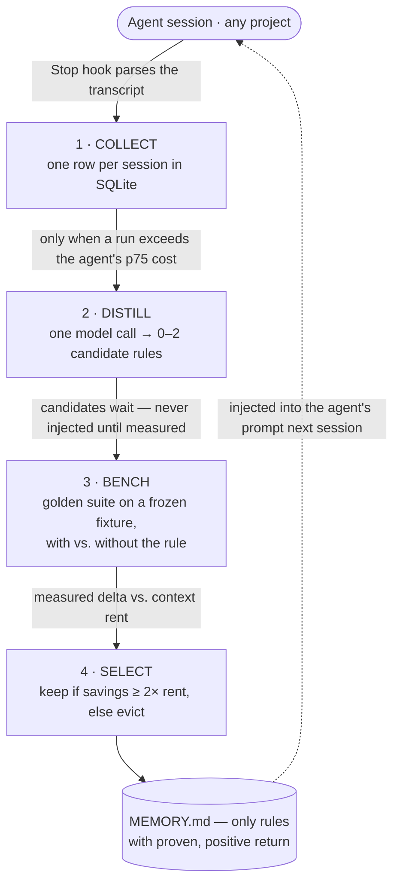
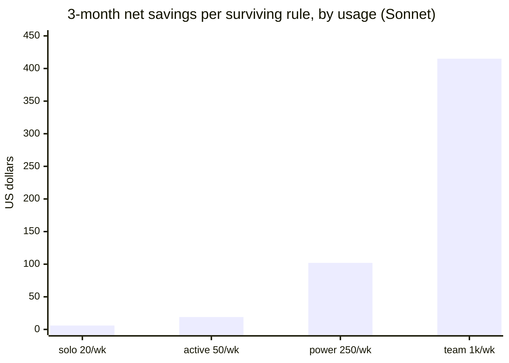

# token-warden

[](https://github.com/vukkt/token-warden/actions/workflows/ci.yml)
[](LICENSE)
[](https://github.com/sponsors/vukkt)

**A Claude Code plugin that makes your coding agents measurably cheaper over time.**

Most "agent memory" accumulates advice nobody ever verifies. token-warden treats agent
memory as an engineering problem: every rule that wants space in an agent's context must
**prove, on a frozen benchmark, that it saves more tokens than it costs** — or it gets
evicted. What survives is a per-agent memory file of rules with a measured, positive return
and a dated receipt for each.

- **Measured, not vibes** — every rule carries a token delta from real benchmark runs.
- **Self-funding** — a rule must save ≥ 2× its own context rent to stay.
- **Self-auditing** — active rules are re-benchmarked and evicted when they stop earning.
- **Zero session overhead** — collection runs in a Stop hook that never blocks or fails your work.

---

## How it works

A four-stage, feed-forward loop. Lessons are extracted from finished sessions and applied to
future ones; past work is never re-done, and nothing reaches an agent's memory until it has
been measured.



1. **Collect** — `Stop` / `SubagentStop` hooks parse each transcript into one ledger row.
   Hard-capped under 2s, fail-open, exits 0 regardless — it can never break your session.
2. **Distill** — only runs above the agent's rolling p75 cost are analyzed. One detached
   model call returns ≤ 2 one-sentence rules; near-duplicates of any past rule (even evicted
   ones) are rejected, and the prompt carries the measured verdicts of past failures so the
   proposer learns instead of re-deriving them.
3. **Bench** — candidates run the golden suite on a frozen fixture repo, with vs. without the
   rule, in throwaway copies.
4. **Select** — a rule goes active only if it saves **≥ 2× its context rent** and breaks no
   task. Every run also re-audits the oldest active rule (two-strike: one noisy sub-threshold
   result puts an earner on probation, only a second consecutive one evicts; a regression
   evicts immediately). Survivors compile into `MEMORY.md`.

---

## What it saves

The keep/evict decision is measured in **tokens**; `/warden-cost` prices it into **dollars**
at [current Anthropic rates](src/pricing.ts) (every rate overridable), and `/warden-cost
--project` scales it over a horizon with a cost **with vs. without** the plugin.

> **These numbers are the [positive control](FINDINGS.md)** — one curated "grep before
> reading" rule on a *deliberately naive* agent, where headroom was manufactured to validate
> the engine. On the already-optimized shipped agents the same rule saves ~$0 (correctly
> evicted). Read it as *"what the engine captures when a rule of this size survives on your
> workload"* — conditional, not a guarantee. Whether your real agents have such a rule to
> catch is exactly what dogfooding answers.

On that naive agent the rule cut a session from **67,252 → 56,553 processing tokens
(−15.9%)** — about **$0.032/session** at Sonnet input pricing ($3/1M), roughly 500× the
rule's context rent. The per-run win is cents; it becomes money through **volume × rule
count × model price**.

Scaled per surviving rule (Sonnet pricing, minus the one-time ~$1.98 benchmark discovery
cost, recovered in ~67 sessions):

| Usage profile | Sessions/week | Net — 3 months | Net — 1 year |
|---|---|---|---|
| Solo dev | 20 | **$6** | **$31** |
| Active dev | 50 | $19 | $81 |
| Power user | 250 | $102 | $415 |
| Small team (10×) | 1,000 | $415 | $1,667 |
| Enterprise (100×) | 10,000 | $4,171 | $16,690 |



Prices scale with the model: relative to Sonnet 5 / 4.6 ($3/1M input), Claude Haiku 4.5 is
~0.3×, Claude Opus 4.8 ~1.7×, and Claude Fable 5 ~3.3× these figures. Run `/warden-cost
--project --sessions-per-week <n>` to compute the table from **your own** surviving rules and
volume.

---

## Getting started

**Quickstart** — with Node.js 22+ and Claude Code v2.1+, install it inside Claude Code:

```text
/plugin marketplace add vukkt/token-warden
/plugin install token-warden@vukkt-plugins
```

Every session, in every project, is now measured automatically (a Stop hook that never
blocks your work). Run `/warden-status` after a turn or two to see your token data.

To unlock the part that *saves* tokens, do the one-time setup:

1. **Clone and install** (the hooks run via the plugin's own `tsx` + `better-sqlite3`):
   ```bash
   git clone https://github.com/vukkt/token-warden.git && cd token-warden && npm install
   ```
2. **Freeze the baselines** (~20 min per agent, once, before any rules exist) — this records
   `run1_tokens`, the permanent denominator of every future improvement claim:
   ```bash
   npm run bench -- --agent all
   ```
3. **Use the four subagents** (`frontend`, `backend`, `sql`, `testing`) for real work.
   Expensive sessions distill into candidate rules automatically.
4. **Measure the candidates** when `/warden-status` shows some pending — survivors land in the
   agent's memory and the next session starts cheaper:
   ```bash
   npx tsx src/select.ts --agent sql
   ```

Prerequisites: Node.js 22+, Claude Code v2.1+, macOS or Linux (Windows via WSL — benchmarks
need a POSIX shell). Marketplace installs bootstrap their own dependencies on first run.

---

## Commands

The keep/evict loop needs only two commands; the rest are read-only reports or optional
measurement tools. All are also runnable as `npx tsx src/<name>.ts`.

**Core loop**

| Command | What it does |
|---|---|
| `/warden-status` | Read-only report: per-agent runs/rules, suite total vs. frozen baseline, learning curve, active rules with deltas + provenance, recent evictions |
| `/warden-bench <agent\|all>` | Runs the golden suite, compares against `run1`/`best`, reports benchmarking meta-cost |
| `/warden-select <agent>` | Measures pending candidates, evicts or activates them, re-audits the oldest active rule, recompiles memory (`--uniform-top-up` for the allocation control arm) |

**Cost, planning & evidence**

| Command | What it does |
|---|---|
| `/warden-cost [--project]` | Prices token savings into dollars at current rates; `--project` scales it over a horizon (with vs. without the plugin) |
| `/warden-power` | Zero-token power planner: from recorded variance, the minimum detectable saving per run count and runs needed for a target — so a burn is provably powered before it spends |
| `/warden-receipt` | The per-rule verdict card: savings vs. rent, variance/ROI, per-task pass/fail, and the model + suite hash it was measured under |
| `/warden-cohort` · `/warden-confirm` | Out-of-fixture validation: did rules make *real* work cheaper, and does fixture survival predict it? Observational, zero tokens, `--gate` for CI |
| `/warden-attribute` | Attributes real-work token footprint to the tools, skills, and MCP servers that produced it |

**A/B benchmarking**

| Command | What it does |
|---|---|
| `/warden-modelbench <agent\|all> --model <id>` | Same suite under two models (rules held constant); `--agent all` adds a per-category regression roll-up |
| `/warden-promptbench <agent> --variant <file>` | Same suite under two agent prompts |
| `/warden-evolve <agent>` | Proposes a token-cheaper prompt rewrite, benchmarks it, recommends only if it provably wins |
| `/warden-compress --agent a --rule <id>` | Proposes a shorter rewrite of a rule (half the rent) and measures it as a swap against the original |

**Governance & sharing**

| Command | What it does |
|---|---|
| `/warden-protect` | Mark a rule human-authored/behavioral — compiled and rent-counted but **never token-evicted** |
| `/warden-contradict` · `/warden-health` | Zero-token flags: rules contradicting the repo's `CLAUDE.md`, and rules stale/un-re-audited. Recommend review, never auto-evict; `--gate` for CI |
| `/warden-scope` | Scope a rule to a context (a language, a service) — compiles as `(when <where>) <rule>` |
| `/warden-share` · `/warden-adopt` | Export active rules to a reviewable ledger; import one as local candidates (re-measured on your own suite before entering memory) |
| `/warden-sample-tasks` | Drafts candidate golden tasks from real transcripts to cut suite-building burden |

Two hooks run automatically: a `SessionStart` nudge when candidates await measurement (set
`TOKEN_WARDEN_AUTO_SELECT=1` to opt into scheduled selection), and a `Stop` cost-anomaly
heads-up when a session runs ≥ 2× the agent's recent median (opt out with
`TOKEN_WARDEN_NO_ALERTS=1`). Namespaced forms (`/token-warden:warden-status`) work headless.

---

## The benchmark system

Measurement is only as good as its controls, and token-warden controls them aggressively.
The **fixture** (`benchmarks/fixture/`) is a small full-stack TypeScript project — Express →
services → repositories over SQLite, a React admin UI, a partial vitest suite — frozen and
never modified, so baselines stay comparable across months. **Golden tasks**
(`benchmarks/<agent>/golden-NN.md`) are frontmatter files with a one-sentence `prompt` and a
shell `success_check`; a run counts as *completed* only if its check passes, and incomplete
runs are excluded from all savings math.

Each run copies the fixture to a temp dir, compiles the rule set under test into a
project-scoped `MEMORY.md` (real agent memory is never touched), runs `claude -p` headlessly
with scoped permissions (`acceptEdits` + a Bash allowlist, never `bypassPermissions`), then
parses the transcript into one row. The first completed run per (agent, task) freezes the
baseline forever; later runs only ratchet the best downward.

**Variance-aware by design.** LLM run-to-run noise is the dominant error source at small
effect sizes, so the selector computes the standard error of the per-task savings and, when a
verdict sits within noise of the threshold, spends one bounded **top-up pass** before
deciding — placed by variance (Neyman allocation) so runs land where the uncertainty is.
Verdicts that remain within noise are recorded with an explicit low-confidence annotation.
The engine also calibrates itself against its own recorded data (see
[FINDINGS.md](FINDINGS.md)): a zero-token A/A harness measures the real false-positive rate,
and `/warden-power` sizes a burn before it spends.

---

## The agents

`frontend`, `backend`, `sql`, and `testing` (`agents/*.md`) are standard Claude Code subagents
with `memory: user` and domain-scoped prompts seeded with efficiency behaviors (Grep before
Read, never re-read a file, one-line plan before editing). Per-agent isolation is deliberate:
a rule that pays rent for the `sql` agent is never charged to `frontend`'s context.

**Bring your own agent.** The bundled four are defaults, not a ceiling. Drop `<name>.md`
definitions into `TOKEN_WARDEN_AGENTS_DIR` (default `~/.token-warden/agents`) and golden
suites into `TOKEN_WARDEN_BENCHMARKS_DIR` (`/warden-sample-tasks` drafts them from your
transcripts), and every command discovers the custom agent automatically. With neither set,
nothing changes. This is how you measure token-warden against *your* workload rather than the
shipped fixture.

---

## Proof it works

Recorded 2026-06-12; every number is from real headless runs. Run #13, an `sql` golden run,
cost 61,003 tokens — above the agent's p75 — and the distiller proposed two candidates. The
selector measured them across 24 headless runs (mean completed tokens per task):

| configuration | sql-01 | sql-02 | sql-03 | delta |
|---|---|---|---|---|
| baseline (active set) | 39,572 | 70,762 (!) | 50,304 | — |
| + rule #3 (`find` consolidation) | 39,541 | 67,114 | 52,116 | **+622 / run → ACTIVE** |
| + rule #4 (parse task direction) | 39,664 | 54,244 | 49,538 | **+5,731 / run → ACTIVE** |
| − rule #1 (re-audit) | 39,671 | 49,006 | 44,315 (!) | −9,215 → **EVICTED** |

(!) marks two same-config runs differing by >25%. Rule #1 — a genuine earner admitted at
+3,673 the previous run — was evicted by a single noisy re-audit draw. That churn is exactly
what motivated **two-strike retention**: today the same measurement would put it on probation
instead, and only a second consecutive sub-threshold result would evict it. Evicted rules are
kept as the negative dataset, and trigram dedupe stops a falsified rule from being re-proposed.

The safety gate is validated too: on a real burn it correctly evicted a rule that "saved"
38k tokens by *breaking the task* — a false economy caught by the completion check. Full
write-ups (positive control, calibration, statistical corrections) are in
[FINDINGS.md](FINDINGS.md).

---

## Design invariants

1. **Candidate rules are never injected until measured** — candidates live only in SQLite.
2. **`MEMORY.md` is a build artifact** — compiled from the ledger, overwritten wholesale,
   never hand-edited.
3. **Fitness = tokens per completed task** — incomplete runs are excluded (a dropped
   completion rate is flagged `COMPLETION-DROP` so the exclusion can't flatter a mean).
4. **Golden tasks run against the frozen fixture**, never a live codebase.
5. **First-run baselines are frozen forever** — `run1_tokens` denominates every claim.
6. **The optimizer never re-does past work** — all learning is feed-forward.
7. **Eviction is mandatory** — rules earn ≥ 2× their rent or leave; active rules are
   re-audited round-robin (two-strike, regressions evict on the spot).

---

## Architecture & internals

The module map, data model, and integration surface are in
[ARCHITECTURE.md](ARCHITECTURE.md); every deviation from the original spec is logged in
[DECISIONS.md](DECISIONS.md). In short: `src/db.ts` owns the SQLite schema and versioned
migrations; `src/transcript.ts` is a pure JSONL parser; `src/collect.ts` / `src/distill.ts`
are the Stop-hook and rule-proposal path; `src/bench.ts` / `src/select.ts` / `src/compare.ts`
are the measurement core; and the ledger (`~/.token-warden/warden.db`) holds runs, rules
(active + evicted), frozen baselines, receipts, and the cross-agent question log.

**Testing** — over 600 tests across every module (exact count in CI, since prose rots),
held above a ratcheted coverage floor that CI fails on regression. The transcript parser
carries the densest coverage against committed anonymized fixtures; hook entrypoints are
tested as real child processes including fail-open paths; the selector core runs against an
injected fake suite-runner so verdict logic is verified without spending model tokens. Strict
TypeScript (`noUncheckedIndexedAccess`), Biome, vitest.

**Security** — the ledger contains untrusted text (model-generated rule bodies, environment
paths). Defenses: the distiller rejects control characters at the source; `displayText`
(`src/sanitize.ts`) sanitizes every untrusted string before it reaches a report; and
`/warden-status` instructs the relaying Claude to treat report contents as data. See
[SECURITY.md](SECURITY.md) to report a vulnerability.

An experimental inter-agent approval gate (`CLAUDE_CODE_EXPERIMENTAL_AGENT_TEAMS=1`)
intercepts `SendMessage` between agents and escalates to you, logging question volume to
`/warden-status`. It fails open and is structurally inert without the flag.

---

## Roadmap

Shipped through v0.37.0 ([CHANGELOG.md](CHANGELOG.md)): the full collect/benchmark/distill/
select loop, variance-aware verdicts, model & prompt A/B benchmarking, automated prompt
evolution, cost-anomaly alerting, team-shared ledgers, tool/skill/MCP attribution, per-rule
receipts, dollar accounting, self-calibration, two-strike retention, best-of-K distillation,
rule compression, out-of-fixture confirmation, a zero-token power planner, distribution-
weighted suites, bring-your-own-agent, and a staged CI/CD pipeline with a ratcheted coverage
floor.

The forward plan is in [ROADMAP.md](ROADMAP.md). The central open question is empirical, not
architectural: **do real-world workloads contain catchable, generalizable headroom?** The
shipped agents are already optimized, so surviving rules have so far come from deliberately
naive positive controls — a production dogfood window is what answers it, and `/warden-cohort`
/ `/warden-confirm` already measure that signal.

## Contributing

Setup, the CI/CD pipeline, the release flow, and the design invariants are in
[CONTRIBUTING.md](CONTRIBUTING.md).

## License

MIT
