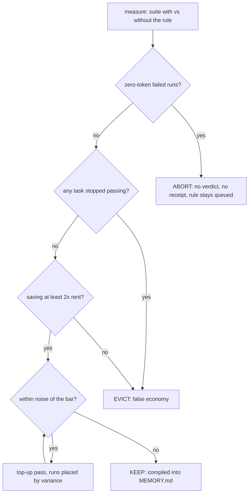

# token-warden

[](https://github.com/vukkt/token-warden/actions/workflows/ci.yml)
[](LICENSE)
[](https://github.com/sponsors/vukkt)

**Agent memory, treated as an engineering problem.** A Claude Code plugin: every rule that
wants space in an agent's context must prove, on a frozen benchmark, that it saves more
tokens than it costs — or it is evicted.

```text
   version   0.41.0                     commands   20 slash commands
     tests   1029 across 47 files         agents   4 bundled + bring-your-own
  coverage   96.85% lines                 source   38 modules, ~12.7k lines
```

---

## What it does

Most "agent memory" accumulates advice nobody verifies. This measures it instead.

1. **Collect** — a `Stop` hook parses each finished session into one SQLite row. Capped
   under 2s, fails open, never blocks your work.
2. **Distill** — sessions above the agent's p75 cost get one model call, returning at most
   two one-sentence candidate rules.
3. **Bench** — candidates run a frozen golden suite headlessly, with and without the rule.
4. **Select** — a rule is kept only if it clears the gate below. Survivors compile into
   `MEMORY.md`; everything else is evicted and kept as the negative dataset.

---

## The gate

Kept only if the measured saving clears **2x its context rent**, with confidence, and breaks
nothing. Every other outcome is a refusal.


```mermaid
flowchart TD
    M["measure: suite with vs without the rule"]
    Q1{"zero-token failed runs?"}
    Q2{"any task stopped passing?"}
    Q3{"saving at least 2x rent?"}
    Q4{"within noise of the bar?"}
    AB["ABORT: no verdict, no receipt, rule stays queued"]
    EV["EVICT: false economy"]
    TU["top-up pass, runs placed by variance"]
    KP["KEEP: compiled into MEMORY.md"]

    M --> Q1
    Q1 -->|yes| AB
    Q1 -->|no| Q2
    Q2 -->|yes| EV
    Q2 -->|no| Q3
    Q3 -->|no| EV
    Q3 -->|yes| Q4
    Q4 -->|yes| TU
    TU --> Q4
    Q4 -->|no| KP
```

Rent is priced cache-aware, so the bar gets *harder* when a ruleset change busts the cache. A
candidate still uncertain after its bounded top-up is evicted, not promoted. On re-audit one
sub-threshold result means probation; only a second consecutive one evicts.

---

## Evidence

Six candidate rules, measured on the `sql` agent across **397 headless golden runs**. Real
ledger, not a simulation.

```text
  measured delta per candidate rule, tokens/run

          -10k      -5k     0      +5k     +10k
  rule 1    -9,215  ######################|
  rule 2    -6,134         ###############|
  rule 3      +622                        |#
  rule 4    +5,731                        |##############
  rule 5   +10,851                        |##########################
```

| Rule | Measured delta | 2x rent bar | Verdict |
|---|---|---|---|
| 1 | -9,215 | 28 | evicted — negative on re-audit |
| 2 | -6,134 | 30 | evicted — negative |
| 3 | +622 | 57 | **ACTIVE** |
| 4 | +5,731 | 60 | **ACTIVE** |
| 5 | +10,851 | 30 | evicted — **uncertain**, SE 7,814 |
| 6 | -71,998 | 30 | evicted — quota-death artifact |

**Row 5 is the point.** It measured +10,851 tokens/run, 362x its bar, and was still evicted:
a standard error of 7,814 meant the result could not be told apart from noise. A number the
project would like to claim, refused because it was not proven. Row 6 is what a quota death
looked like before v0.38.0 learned to recognize one — today that pass records no verdict at
all.

---

## What it is worth

The two surviving rules save a combined **6,353 tokens per session**, measured. At Claude
Sonnet input pricing ($3/1M) that is **$0.019 per session** — cents individually, compounding
through volume x agent count x model price.

| Deployment | Sessions/week | Per year, one agent | Per year, four agents |
|---|---|---|---|
| Solo developer | 20 | $20 | $79 |
| Small team (5x) | 100 | $99 | $396 |
| Engineering org (50x) | 1,000 | $991 | $3,964 |
| Enterprise (250x) | 5,000 | $4,955 | $19,821 |
| Platform scale | 25,000 | $24,777 | $99,107 |

Scaling by model: Haiku ~0.33x, Opus ~1.67x, Fable ~3.3x these figures. Reproduce any row
with `/warden-cost --project --sessions-per-week <n>`.

> **Read this before quoting the table.** These are golden-suite measurements on a frozen
> fixture, priced at the input rate — not observed production invoices. They assume rules of
> this size survive on your workload, which is exactly what the plugin measures rather than
> assumes. The shipped agents are already optimized, so larger figures elsewhere in
> [FINDINGS.md](FINDINGS.md) come from a deliberately naive positive control, and the
> rule-compression A/B is closed as **unconfirmable**, not as a win. **No rule distilled from
> day-to-day production work has yet survived the gate.** Whether real workloads hold
> catchable, generalizable headroom is the open question — `/warden-cohort` and
> `/warden-confirm` are what answer it.

---

## Getting started

Node.js 22+, Claude Code v2.1+.

```text
/plugin marketplace add vukkt/token-warden
/plugin install token-warden@vukkt-plugins
```

Every session is now measured; run `/warden-status` after a turn or two. To unlock the part
that *saves* tokens:

```bash
git clone https://github.com/vukkt/token-warden.git && cd token-warden && npm install
npm run bench -- --agent all      # freeze baselines, ~20 min/agent, once
npx tsx src/select.ts --agent sql # measure candidates once some are pending
```

Step 2 spends real tokens — run `/warden-power` first to size it. macOS or Linux; Windows
via WSL.

---

## Commands

Two commands run the loop; the rest are read-only reports or optional tools.

| | |
|---|---|
| `/warden-status` · `/warden-bench` · `/warden-select` | The loop: report, measure, decide |
| `/warden-cost` · `/warden-power` · `/warden-receipt` | Dollars, burn planning, per-rule verdict cards |
| `/warden-cohort` · `/warden-confirm` | Did rules make *real* work cheaper? `--gate` for CI |
| `/warden-attribute` | Attribute real-work tokens to tools, skills, MCP servers |
| `/warden-modelbench` · `/warden-promptbench` · `/warden-evolve` · `/warden-compress` | A/B: models, prompts, prompt rewrites, rule compression |
| `/warden-protect` · `/warden-scope` · `/warden-health` · `/warden-contradict` | Governance: pin, scope, flag stale or conflicting rules |
| `/warden-share` · `/warden-adopt` · `/warden-sample-tasks` | Share a reviewable ledger; draft golden tasks |

---

## Internals

**Measurement.** The fixture is a small full-stack TypeScript project, frozen so baselines
stay comparable for months. Each run copies it to a temp dir, compiles the rule set into a
project-scoped `MEMORY.md` (real agent memory is never touched), and runs `claude -p` under
scoped permissions — `acceptEdits` plus a Bash allowlist, never `bypassPermissions` — in a
stripped environment, so a benchmark child can never inherit the parent session. The first
completed run per task freezes its baseline forever.

**Variance.** Run-to-run noise dominates at small effect sizes, so the selector computes the
standard error of per-task savings and spends one bounded top-up pass, placed by variance
(Neyman allocation), when a verdict sits within noise. A zero-token A/A harness measures the
real false-positive rate against recorded data: **8.8%**, against the ~2.5% a synthetic model
predicted. That gap is why `/warden-power` exists.

**Engineering.** 1029 tests across 47 files above a CI-enforced coverage floor
(96/96/96/89; currently 96.85 lines / 96.00 statements / 97.14 functions / 89.10 branches).
Strict TypeScript with `noUncheckedIndexedAccess`, Biome, vitest, knip. The ledger holds
untrusted model-generated text, so every rule body is validated at the boundary
(`src/rules.ts`) and sanitized before display (`src/sanitize.ts`).

**Bring your own agent.** The bundled `frontend`, `backend`, `sql` and `testing` are
defaults, not a ceiling. Point `TOKEN_WARDEN_AGENTS_DIR` and `TOKEN_WARDEN_BENCHMARKS_DIR`
at your own definitions and suites to measure against *your* workload.

[ARCHITECTURE.md](ARCHITECTURE.md) · [DECISIONS.md](DECISIONS.md) ·
[FINDINGS.md](FINDINGS.md) · [ROADMAP.md](ROADMAP.md) · [CONTRIBUTING.md](CONTRIBUTING.md) ·
[SECURITY.md](SECURITY.md)

MIT.
