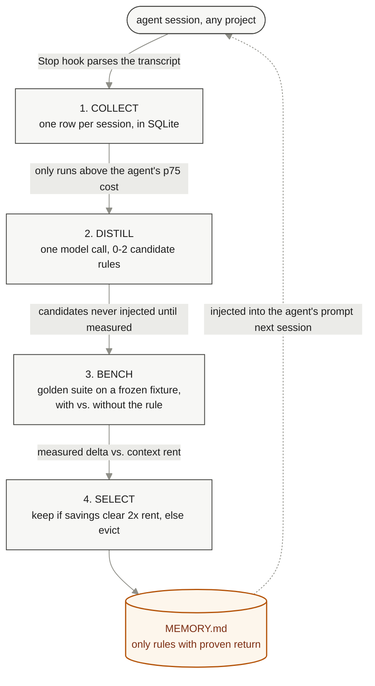
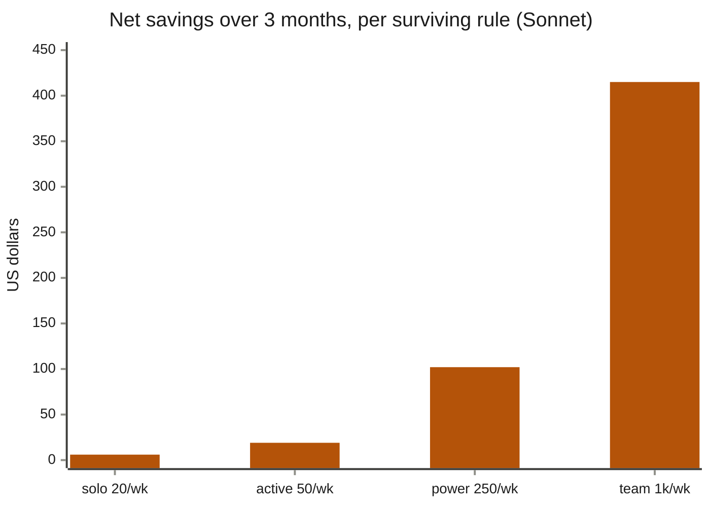

# token-warden

[](https://github.com/vukkt/token-warden/actions/workflows/ci.yml)
[](LICENSE)
[](https://github.com/sponsors/vukkt)

**Agent memory, treated as an engineering problem.** A Claude Code plugin: every rule that
wants space in an agent's context must prove, on a frozen benchmark, that it saves more
tokens than it costs — or it is evicted.

```text
   version   0.40.0                     commands   20 slash commands
     tests   1017 across 47 files         agents   4 bundled + bring-your-own
  coverage   96.37% lines                 source   32 modules, ~12k lines
```

Most "agent memory" accumulates advice nobody ever verifies. What survives here is a
per-agent memory file of rules with a measured, positive return and a dated receipt for
each one.

- **Measured, not vibes** — every rule carries a token delta from real benchmark runs.
- **Self-funding** — a rule must save >= 2x its own context rent to stay.
- **Self-auditing** — active rules are re-benchmarked and evicted when they stop earning.
- **Zero session overhead** — collection runs in a `Stop` hook that never blocks or fails
  your work.
- **Environment-honest** — a quota-dead measurement records no verdict at all; it can never
  masquerade as an eviction.

---

## How it works

A four-stage, feed-forward loop. Lessons are extracted from finished sessions and applied
to future ones; past work is never re-done, and nothing reaches an agent's memory until it
has been measured.


```mermaid
%%{init: {"theme":"base","themeVariables":{"fontFamily":"ui-monospace, SFMono-Regular, Menlo, monospace","fontSize":"13px","primaryColor":"#f7f7f5","primaryTextColor":"#1c1c1c","primaryBorderColor":"#3f3f3c","secondaryColor":"#ebebe8","tertiaryColor":"#ffffff","lineColor":"#8f8f88","textColor":"#1c1c1c"}}}%%
flowchart TD
    A(["agent session, any project"]) -->|"Stop hook parses the transcript"| B["1. COLLECT<br/>one row per session, in SQLite"]
    B -->|"only runs above the agent's p75 cost"| C["2. DISTILL<br/>one model call, 0-2 candidate rules"]
    C -->|"candidates never injected until measured"| D["3. BENCH<br/>golden suite on a frozen fixture,<br/>with vs. without the rule"]
    D -->|"measured delta vs. context rent"| E["4. SELECT<br/>keep if savings clear 2x rent, else evict"]
    E --> F[("MEMORY.md<br/>only rules with proven return")]
    F -.->|"injected into the agent's prompt next session"| A

    classDef accent fill:#fdf6ec,stroke:#b45309,stroke-width:1.5px,color:#7c2d12;
    class F accent;
```

1. **Collect** — `Stop` / `SubagentStop` hooks parse each transcript into one ledger row.
   Hard-capped under 2s, fail-open, exits 0 regardless — it can never break your session.
2. **Distill** — only runs above the agent's rolling p75 cost are analyzed. One detached
   model call returns <= 2 one-sentence rules; near-duplicates of any past rule (even
   evicted ones) are rejected, and the prompt carries the measured verdicts of past
   failures so the proposer learns instead of re-deriving them.
3. **Bench** — candidates run the golden suite on a frozen fixture repo, with vs. without
   the rule, in throwaway copies.
4. **Select** — survivors compile into `MEMORY.md`. Every run also re-audits the oldest
   active rule, so admission is not permanent.

---

## The gate

One threshold decides everything: a rule is kept only if its measured saving clears **2x
its context rent**, with confidence, and breaks nothing. Every other outcome is a refusal.


```mermaid
%%{init: {"theme":"base","themeVariables":{"fontFamily":"ui-monospace, SFMono-Regular, Menlo, monospace","fontSize":"13px","primaryColor":"#f7f7f5","primaryTextColor":"#1c1c1c","primaryBorderColor":"#3f3f3c","secondaryColor":"#ebebe8","tertiaryColor":"#ffffff","lineColor":"#8f8f88","textColor":"#1c1c1c"}}}%%
flowchart TD
    M["measure: suite with vs. without the rule"] --> Q1{"zero-token failed runs?"}
    Q1 -->|"yes"| AB["ABORT<br/>no verdict, no receipt,<br/>rule stays queued"]
    Q1 -->|"no"| Q2{"any task stopped passing?"}
    Q2 -->|"yes"| EV["EVICT<br/>false economy"]
    Q2 -->|"no"| Q3{"saving at least 2x rent?"}
    Q3 -->|"no"| EV
    Q3 -->|"yes"| Q4{"within noise of the bar?"}
    Q4 -->|"yes"| TU["top-up pass<br/>runs placed by variance"] --> Q4
    Q4 -->|"no"| KP["KEEP<br/>compiled into MEMORY.md"]

    classDef accent fill:#fdf6ec,stroke:#b45309,stroke-width:1.5px,color:#7c2d12;
    class KP accent;
```

**Rent** is what the rule's own text costs to carry, priced cache-aware, so the bar gets
harder rather than easier when a ruleset change forces a cache re-prefill. A candidate that
is still uncertain after its bounded top-up is evicted, not promoted — the burden of proof
sits on the rule.

**Re-audit** is gentler than admission, because noise cuts both ways: one sub-threshold
result puts a proven earner on probation, and only a second consecutive one evicts it. A
regression evicts on the spot.

**Environment failure is not evidence.** A failed run below 1,000 tokens cannot be a rule's
fault — the cheapest genuine golden run observed is ~34k, and even a rule-broken run burns
thousands attempting the task. Four consecutive such runs abort the pass early; a majority
of them in any pass aborts the whole decision. Nothing is persisted, no memory is
recompiled, and the candidate returns to the queue. This guard was validated live through
three real quota deaths (see [FINDINGS.md](FINDINGS.md)), where earlier versions had
finalized garbage verdicts.

---

## What it saves

> **POSITIVE CONTROL — read the caveat before the number.** The figures below come from one
> curated "grep before reading" rule measured on a *deliberately naive* agent whose prompt
> had its efficiency guidance stripped, so that headroom existed to find. On the
> already-optimized shipped agents the same rule saves about zero and is correctly
> **evicted**. Read this as *"what the engine captures when a rule of this size survives on
> your workload"* — conditional, not a guarantee. Whether your real agents have such a rule
> to catch is exactly the open question ([FINDINGS.md](FINDINGS.md)).

On that naive agent the rule cut a session from **67,252 to 56,553 processing tokens
(-15.9%)**, a mean of **+10,699 tokens/run** against a 2x-rent bar of **42** — about
**$0.032/session** at Sonnet input pricing ($3/1M), and roughly 500x the rule's rent. The
per-run win is cents; it becomes money through volume x rule count x model price.

Scaled per surviving rule at Sonnet rates, net of the one-time ~$1.98 benchmark discovery
cost:

| Usage profile | Sessions/week | Net, 3 months | Net, 1 year |
|---|---|---|---|
| Solo dev | 20 | $6 | $31 |
| Active dev | 50 | $19 | $81 |
| Power user | 250 | $102 | $415 |
| Small team (10x) | 1,000 | $415 | $1,667 |
| Enterprise (100x) | 10,000 | $4,171 | $16,690 |


```mermaid
%%{init: {"theme":"base","themeVariables":{"fontFamily":"ui-monospace, SFMono-Regular, Menlo, monospace","fontSize":"13px","xyChart":{"backgroundColor":"#ffffff","titleColor":"#1c1c1c","xAxisLabelColor":"#1c1c1c","xAxisTitleColor":"#1c1c1c","xAxisTickColor":"#8f8f88","xAxisLineColor":"#3f3f3c","yAxisLabelColor":"#1c1c1c","yAxisTitleColor":"#1c1c1c","yAxisTickColor":"#8f8f88","yAxisLineColor":"#3f3f3c","plotColorPalette":"#b45309"}}}}%%
xychart-beta
    title "Net savings over 3 months, per surviving rule (Sonnet)"
    x-axis ["solo 20/wk", "active 50/wk", "power 250/wk", "team 1k/wk"]
    y-axis "US dollars" 0 --> 450
    bar [6, 19, 102, 415]
```

The keep/evict decision itself is always made in **tokens**; dollars are a reporting lens.
`/warden-cost` prices savings at [current Anthropic rates](src/pricing.ts) (every rate
env-overridable) and `--project` scales them over a horizon, with vs. without the plugin.
Prices scale with the model: relative to Sonnet 5 / 4.6 at $3/1M input, Haiku 4.5 is ~0.3x,
Opus 5 / 4.8 ~1.7x, and Fable 5 ~3.3x these figures. Run `/warden-cost --project
--sessions-per-week <n>` to compute this table from **your own** surviving rules.

---

## Getting started

**Quickstart** — install from inside Claude Code:

```text
/plugin marketplace add vukkt/token-warden
/plugin install token-warden@vukkt-plugins
```

Every session, in every project, is now measured automatically. Run `/warden-status` after
a turn or two to see your token data.

To unlock the part that *saves* tokens, do the one-time setup:

1. **Clone and install** — the hooks run via the plugin's own `tsx` + `better-sqlite3`:
   ```bash
   git clone https://github.com/vukkt/token-warden.git && cd token-warden && npm install
   ```
2. **Freeze the baselines** — ~20 min per agent, once, before any rules exist. This records
   `run1_tokens`, the permanent denominator of every future improvement claim:
   ```bash
   npm run bench -- --agent all
   ```
3. **Use the subagents** (`frontend`, `backend`, `sql`, `testing`) for real work. Expensive
   sessions distill into candidate rules automatically.
4. **Measure the candidates** when `/warden-status` shows some pending. Survivors land in
   the agent's memory and the next session starts cheaper:
   ```bash
   npx tsx src/select.ts --agent sql
   ```

Requires Node.js 22+, Claude Code v2.1+, macOS or Linux (Windows via WSL — benchmarks need
a POSIX shell). Marketplace installs bootstrap their own dependencies on first run.

---

## Commands

The keep/evict loop needs only `/warden-bench` and `/warden-select`. Everything else is a
read-only report or an optional measurement tool. All are also runnable as
`npx tsx src/<name>.ts`.

**Core loop**

| Command | What it does |
|---|---|
| `/warden-status` | Per-agent runs and rules, suite total vs. frozen baseline, learning curve, active rules with deltas and provenance, recent evictions |
| `/warden-bench <agent\|all>` | Runs the golden suite, compares against `run1` and `best`, reports benchmarking meta-cost |
| `/warden-select <agent>` | Measures pending candidates, evicts or activates them, re-audits the oldest active rule, recompiles memory |

**Cost, planning and evidence**

| Command | What it does |
|---|---|
| `/warden-cost [--project]` | Prices token savings into dollars; `--project` scales over a horizon, with vs. without the plugin |
| `/warden-power` | Zero-token power planner: from recorded variance, the minimum detectable saving per run count and the runs needed for a target, so a burn is provably powered before it spends |
| `/warden-receipt` | Per-rule verdict card: savings vs. rent, variance and ROI, per-task pass/fail, and the model plus suite hash it was measured under |
| `/warden-cohort` `/warden-confirm` | Out-of-fixture validation: did rules make *real* work cheaper, and does fixture survival predict it? Observational, zero tokens, `--gate` for CI |
| `/warden-attribute` | Attributes real-work token footprint to the tools, skills and MCP servers that produced it |

**A/B benchmarking**

| Command | What it does |
|---|---|
| `/warden-modelbench <agent\|all> --model <id>` | Same suite under two models, rules held constant; `--agent all` adds a per-category regression roll-up |
| `/warden-promptbench <agent> --variant <file>` | Same suite under two agent prompts |
| `/warden-evolve <agent>` | Proposes a token-cheaper prompt rewrite, benchmarks it, recommends only if it provably wins |
| `/warden-compress --agent a --rule <id>` | Proposes a shorter rewrite of a rule at half the rent and measures it as a swap against the original |

**Governance and sharing**

| Command | What it does |
|---|---|
| `/warden-protect` | Mark a rule human-authored or behavioral: compiled and rent-counted, but never token-evicted |
| `/warden-contradict` `/warden-health` | Zero-token flags for rules contradicting the repo's `CLAUDE.md`, and rules stale or un-re-audited. Recommend review, never auto-evict; `--gate` for CI |
| `/warden-scope` | Scope a rule to a context, a language or a service — compiles as `(when <where>) <rule>` |
| `/warden-share` `/warden-adopt` | Export active rules to a reviewable ledger; import one as local candidates, re-measured on your own suite before entering memory |
| `/warden-sample-tasks` | Drafts candidate golden tasks from real transcripts, to cut suite-building burden |

Two hooks run on their own: a `SessionStart` nudge when candidates await measurement (set
`TOKEN_WARDEN_AUTO_SELECT=1` to opt into scheduled selection), and a `Stop` cost-anomaly
heads-up when a session runs >= 2x the agent's recent median (opt out with
`TOKEN_WARDEN_NO_ALERTS=1`). Namespaced forms (`/token-warden:warden-status`) work headless.

---

## The benchmark system

Measurement is only as good as its controls. The **fixture** (`benchmarks/fixture/`) is a
small full-stack TypeScript project — Express to services to repositories over SQLite, a
React admin UI, a partial vitest suite — frozen and never modified, so baselines stay
comparable across months. **Golden tasks** (`benchmarks/<agent>/golden-NN.md`) are
frontmatter files with a one-sentence `prompt` and a shell `success_check`; a run counts as
*completed* only if its check passes, and incomplete runs are excluded from all savings
math. A task may carry a `weight`, so a rare but expensive production case is measured in
proportion to its real value instead of being diluted by common cheap ones.

Each run copies the fixture to a temp dir, compiles the rule set under test into a
project-scoped `MEMORY.md` (real agent memory is never touched), runs `claude -p` headlessly
with scoped permissions (`acceptEdits` plus a Bash allowlist, never `bypassPermissions`),
then parses the transcript into one row. Benchmark subprocesses run with a stripped
environment so a bench started from inside a Claude Code session cannot bind to, and
measure, its parent's transcript. The first completed run per (agent, task) freezes the
baseline forever; later runs only ratchet the best downward.

**Variance is the adversary.** LLM run-to-run noise dominates at small effect sizes, so the
selector computes the standard error of the per-task savings, and when a verdict sits within
noise of the threshold it spends one bounded top-up pass before deciding — placed by
variance (Neyman allocation) so runs land where the uncertainty is. Verdicts still within
noise are recorded with an explicit low-confidence annotation.

The engine also calibrates itself against its own recorded data. A zero-token A/A harness
resamples real recorded runs through the real verdict path, where the true saving is zero
by construction, so the keep rate *is* the false-positive rate. On the `sql` pool at 2
runs/side it measured **8.8%** — against the ~4% the earlier synthetic model had claimed.
That number is published rather than tuned away, and it sharpens as run history
accumulates. `/warden-power` turns the same variances into a plan, so a burn is sized
before it spends instead of being called inconclusive after.

---

## The agents

`frontend`, `backend`, `sql` and `testing` (`agents/*.md`) are standard Claude Code
subagents with `memory: user` and domain-scoped prompts seeded with efficiency behaviors:
Grep before Read, never re-read a file, one-line plan before editing. Per-agent isolation is
deliberate — a rule that pays rent for the `sql` agent is never charged to `frontend`.

**Bring your own agent.** The bundled four are defaults, not a ceiling. Drop `<name>.md`
definitions into `TOKEN_WARDEN_AGENTS_DIR` (default `~/.token-warden/agents`) and golden
suites into `TOKEN_WARDEN_BENCHMARKS_DIR`, and every command discovers the custom agent
automatically; `/warden-sample-tasks` drafts the suites from your own transcripts. With
neither set, nothing changes. This is how you measure token-warden against *your* workload
rather than the shipped fixture.

---

## Evidence

Recorded 2026-06-12; every number is from real headless runs. Run #13, an `sql` golden run,
cost 61,003 tokens — above the agent's p75 — and the distiller proposed two candidates. The
selector measured them across 24 headless runs (mean completed tokens per task):

| Configuration | sql-01 | sql-02 | sql-03 | Verdict |
|---|---|---|---|---|
| baseline (active set) | 39,572 | 70,762 (!) | 50,304 | — |
| + rule #3, `find` consolidation | 39,541 | 67,114 | 52,116 | +622/run, ACTIVE |
| + rule #4, parse task direction | 39,664 | 54,244 | 49,538 | +5,731/run, ACTIVE |
| rule #1 removed, re-audit | 39,671 | 49,006 | 44,315 (!) | -9,215, EVICTED |

(!) marks two same-config runs differing by more than 25%. Rule #1 — a genuine earner
admitted at +3,673 the previous run — was evicted by a single noisy re-audit draw. That
churn is what motivated two-strike retention: today the same measurement would put it on
probation, and only a second consecutive sub-threshold result would evict. Evicted rules are
kept as the negative dataset, and trigram dedupe stops a falsified rule from being
re-proposed.

The safety gate is validated too: on a real burn it correctly evicted a rule that "saved"
38k tokens by *breaking the task* — a false economy caught by the completion check.

**What is not proven.** The rule-body compression A/B is closed as **unconfirmable in this
environment**, not as a win: three real-token burns were each killed by quota exhaustion,
and the effect — whatever its sign — is smaller than the sql suite's derailment noise at any
run count the available quota windows can hold. The one clean half of one burn showed
+10,851 tokens/run at half rent with 7/7 tasks passing, and that is exactly the kind of
promising-but-unbanked number this project refuses to claim. Full write-ups — positive
control, calibration, statistical corrections, all three failed burns — are in
[FINDINGS.md](FINDINGS.md).

---

## Design invariants

1. **Candidate rules are never injected until measured** — candidates live only in SQLite.
2. **`MEMORY.md` is a build artifact** — compiled from the ledger, overwritten wholesale,
   never hand-edited.
3. **Fitness is tokens per completed task** — incomplete runs are excluded, and a dropped
   completion rate is flagged `COMPLETION-DROP` so the exclusion cannot flatter a mean.
4. **Golden tasks run against the frozen fixture**, never a live codebase.
5. **First-run baselines are frozen forever** — `run1_tokens` denominates every claim.
6. **The optimizer never re-does past work** — all learning is feed-forward.
7. **Eviction is mandatory** — rules earn >= 2x their rent or leave; active rules are
   re-audited round-robin, two-strike, with regressions evicting on the spot.

---

## Internals

The module map, data model and integration surface are in
[ARCHITECTURE.md](ARCHITECTURE.md); every deviation from the original spec is logged in
[DECISIONS.md](DECISIONS.md). In short: `src/db.ts` owns the SQLite schema and its versioned
migrations; `src/transcript.ts` is a pure JSONL parser; `src/collect.ts` and
`src/distill.ts` are the Stop-hook and rule-proposal path; `src/bench.ts`, `src/select.ts`
and `src/compare.ts` are the measurement core; and the ledger
(`~/.token-warden/warden.db`) holds runs, rules (active and evicted), frozen baselines,
receipts and the cross-agent question log.

**Testing** — 1017 tests across 47 files at v0.40.0, held above a ratcheted coverage floor
that CI fails on regression — floor 96 lines / 95 statements / 96 functions / 88 branches,
currently measuring 96.37% lines / 88.78% branches / 96.15% functions / 95.56% statements.
The transcript parser carries the densest coverage against committed
anonymized fixtures; hook entrypoints are tested as real child processes including
fail-open paths; the selector core runs against an injected fake suite-runner, so verdict
logic is verified without spending model tokens. Strict TypeScript
(`noUncheckedIndexedAccess`), Biome, vitest, knip.

**Security** — the ledger holds untrusted text: model-generated rule bodies, environment
paths. Defenses: the distiller rejects control characters at the source; `displayText`
(`src/sanitize.ts`) sanitizes every untrusted string before it reaches a report; and
`/warden-status` instructs the relaying Claude to treat report contents as data. See
[SECURITY.md](SECURITY.md) to report a vulnerability.

An experimental inter-agent approval gate (`CLAUDE_CODE_EXPERIMENTAL_AGENT_TEAMS=1`)
intercepts `SendMessage` between agents and escalates to you, logging question volume to
`/warden-status`. It fails open and is structurally inert without the flag.

---

## Roadmap

Shipped through v0.39.0 ([CHANGELOG.md](CHANGELOG.md)): the full collect/distill/bench/
select loop, variance-aware verdicts, model and prompt A/B benchmarking, automated prompt
evolution, cost-anomaly alerting, team-shared ledgers, tool/skill/MCP attribution, per-rule
receipts, dollar accounting, self-calibration, two-strike retention, best-of-K distillation,
rule compression, out-of-fixture confirmation, a zero-token power planner,
distribution-weighted suites, bring-your-own-agent, the four-layer environment-failure abort
(v0.38.0, completed in v0.39.0), and a staged CI/CD pipeline with a ratcheted coverage
floor.

The forward plan is in [ROADMAP.md](ROADMAP.md). The central open question is empirical, not
architectural: **do real-world workloads contain catchable, generalizable headroom?** The
shipped agents are already optimized, so the large savings above come from a deliberately
naive positive control. Two rules have survived the gate on a shipped agent (+622 and
+5,731 tok/run on `sql`, in the table above) — but those were distilled from golden-suite
runs, not from day-to-day work. **No rule distilled from real production work has yet
survived the gate.** A production dogfood window is what answers it, and `/warden-cohort`
and `/warden-confirm` already measure that signal.

## Contributing

Setup, the CI/CD pipeline, the release flow and the design invariants are in
[CONTRIBUTING.md](CONTRIBUTING.md).

## License

MIT
