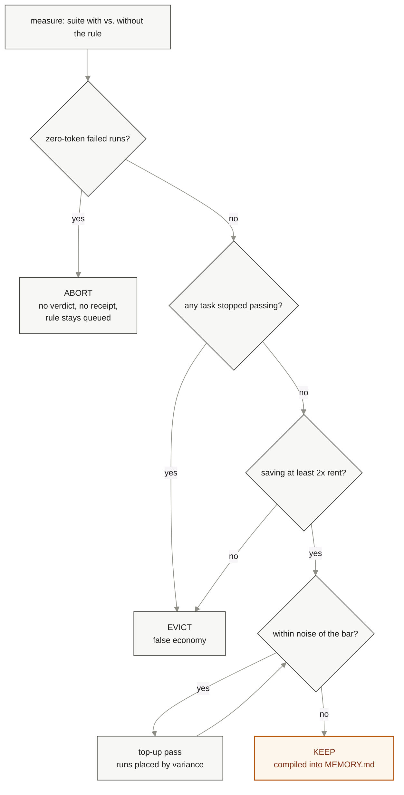
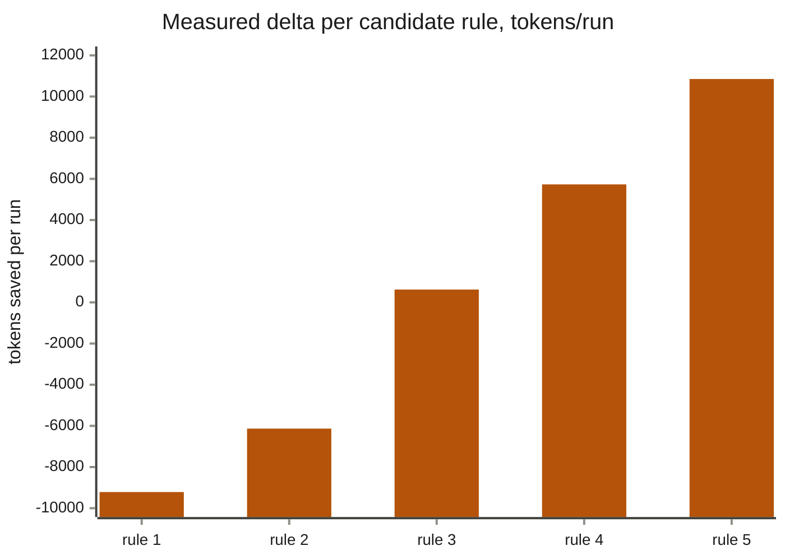

# token-warden

[](https://github.com/vukkt/token-warden/actions/workflows/ci.yml)
[](LICENSE)
[](https://github.com/sponsors/vukkt)

**Agent memory, treated as an engineering problem.** A Claude Code plugin: every rule that
wants space in an agent's context must prove, on a frozen benchmark, that it saves more
tokens than it costs — or it is evicted.

```text
   version   0.41.0                     commands   20 slash commands
     tests   1029 across 47 files         agents   4 bundled + bring-your-own
  coverage   96.85% lines                 source   38 modules, ~12.7k lines
```

- **Measured, not vibes** — every rule carries a token delta from real benchmark runs.
- **Self-funding** — a rule must save at least 2x its own context rent to stay.
- **Self-auditing** — active rules are re-benchmarked and evicted when they stop earning.
- **Zero session overhead** — collection runs in a `Stop` hook that never blocks your work.
- **Environment-honest** — a quota-dead measurement records no verdict at all.

---

## Architecture

Ten steps, feed-forward. Nothing reaches an agent's memory until it has been measured.


```mermaid
%%{init: {"theme":"base","themeVariables":{"fontFamily":"ui-monospace, SFMono-Regular, Menlo, monospace","fontSize":"13px","primaryColor":"#f7f7f5","primaryTextColor":"#1c1c1c","primaryBorderColor":"#3f3f3c","lineColor":"#8f8f88","textColor":"#1c1c1c"}}}%%
flowchart LR
    subgraph CLI["CLI environment"]
        S(["Claude Code session"])
        H["Stop / SubagentStop hooks"]
    end

    subgraph DATA["Data and storage"]
        DB[("better-sqlite3 ledger")]
        M["distiller model call"]
        C["candidate rules"]
    end

    subgraph EVAL["Evaluation and benchmarking"]
        B["benchmark runner, headless"]
        FX["frozen fixture repo"]
        G["golden task suites"]
    end

    subgraph LOOP["Selection and feedback"]
        SEL{{"selector: saving at least 2x rent?"}}
        MEM[("MEMORY.md, compiled rules")]
    end

    S -->|"1 non-blocking intercept"| H
    H -->|"2 session transcript"| DB
    DB -->|"3 analyze, above p75"| M
    M -->|"4 distill rules"| C
    C -->|"5 verify"| B
    B -->|"6 spawn agent"| FX
    FX -->|"7 measure delta"| G
    G -.->|"8 verification math"| SEL
    SEL -->|"9 activate rules"| MEM
    MEM -->|"10 inject next run"| S

    classDef accent fill:#fdf6ec,stroke:#b45309,stroke-width:1.5px,color:#7c2d12;
    class MEM accent;
```

---

## The gate

A rule is kept only if its measured saving clears **2x its context rent**, with confidence,
and breaks nothing. Every other outcome is a refusal.


```mermaid
%%{init: {"theme":"base","themeVariables":{"fontFamily":"ui-monospace, SFMono-Regular, Menlo, monospace","fontSize":"13px","primaryColor":"#f7f7f5","primaryTextColor":"#1c1c1c","primaryBorderColor":"#3f3f3c","lineColor":"#8f8f88","textColor":"#1c1c1c"}}}%%
flowchart TD
    M["measure: suite with vs. without the rule"] --> Q1{"zero-token failed runs?"}
    Q1 -->|"yes"| AB["ABORT<br/>no verdict, no receipt,<br/>rule stays queued"]
    Q1 -->|"no"| Q2{"any task stopped passing?"}
    Q2 -->|"yes"| EV["EVICT<br/>false economy"]
    Q2 -->|"no"| Q3{"saving at least 2x rent?"}
    Q3 -->|"no"| EV
    Q3 -->|"yes"| Q4{"within noise of the bar?"}
    Q4 -->|"yes"| TU["top-up pass<br/>runs placed by variance"] --> Q4
    Q4 -->|"no"| KP["KEEP<br/>compiled into MEMORY.md"]

    classDef accent fill:#fdf6ec,stroke:#b45309,stroke-width:1.5px,color:#7c2d12;
    class KP accent;
```

**Rent** is priced cache-aware, so the bar gets *harder* when a ruleset change forces a cache
re-prefill. A candidate still uncertain after its bounded top-up is evicted, not promoted.
**Re-audit** is gentler: one sub-threshold result puts a proven earner on probation, and only
a second consecutive one evicts. A regression evicts on the spot.

---

## Evidence

Read from a real ledger — six candidate rules measured on the `sql` agent across **397
headless golden runs**. Not a simulation.


```mermaid
%%{init: {"theme":"base","themeVariables":{"fontFamily":"ui-monospace, SFMono-Regular, Menlo, monospace","fontSize":"13px","xyChart":{"backgroundColor":"#ffffff","titleColor":"#1c1c1c","xAxisLabelColor":"#1c1c1c","xAxisTitleColor":"#1c1c1c","xAxisTickColor":"#8f8f88","xAxisLineColor":"#3f3f3c","yAxisLabelColor":"#1c1c1c","yAxisTitleColor":"#1c1c1c","yAxisTickColor":"#8f8f88","yAxisLineColor":"#3f3f3c","plotColorPalette":"#b45309"}}}}%%
xychart-beta
    title "Measured delta per candidate rule, tokens/run"
    x-axis ["rule 1", "rule 2", "rule 3", "rule 4", "rule 5"]
    y-axis "tokens saved per run" -10000 --> 12000
    bar [-9215, -6134, 622, 5731, 10851]
```

| Rule | Measured delta | 2x rent bar | Verdict | Why |
|---|---|---|---|---|
| 1 | -9,215 | 28 | evicted | negative on re-audit |
| 2 | -6,134 | 30 | evicted | negative |
| 3 | +622 | 57 | **ACTIVE** | clears the bar |
| 4 | +5,731 | 60 | **ACTIVE** | clears the bar |
| 5 | +10,851 | 30 | evicted | **uncertain** — SE 7,814 |
| 6 | -71,998 | 30 | evicted | quota-death artifact, see below |

**Read row 5 first.** It measured +10,851 tokens/run — 362x its bar — and was still evicted,
because a standard error of 7,814 meant the result could not be told apart from noise at
z=2. That is the whole thesis in one row: a number this project would like to claim,
refused because it was not proven.

**Row 6 is why the abort guard exists.** That -71,998 is not a measurement; it is what a
quota death looked like *before* v0.38.0 could recognize one. Today the same pass records no
verdict at all. Two rules survived. Four did not.

**What is not proven.** Rule 5 is the rule-body compression candidate, and that A/B is closed
as **unconfirmable in this environment** rather than as a win: three real-token burns were
each killed by quota exhaustion, and the effect is smaller than the sql suite's derailment
noise at any run count the available windows can hold. The shipped agents are already
optimized, so the *large* savings elsewhere in [FINDINGS.md](FINDINGS.md) come from a
deliberately naive positive control. **No rule distilled from day-to-day production work has
yet survived the gate** — whether real workloads hold catchable, generalizable headroom is
the open question, and `/warden-cohort` and `/warden-confirm` are what answer it.

---

## Getting started

Node.js 22+ and Claude Code v2.1+:

```text
/plugin marketplace add vukkt/token-warden
/plugin install token-warden@vukkt-plugins
```

Every session is now measured. Run `/warden-status` after a turn or two. To unlock the part
that *saves* tokens:

```bash
git clone https://github.com/vukkt/token-warden.git && cd token-warden && npm install
npm run bench -- --agent all      # freeze baselines, ~20 min/agent, once
npx tsx src/select.ts --agent sql # measure candidates once /warden-status shows some
```

Step 2 is the one that spends real tokens — run `/warden-power` first to size it. Use the
four subagents (`frontend`, `backend`, `sql`, `testing`) for real work; expensive sessions
distill candidates automatically. macOS or Linux, Windows via WSL.

---

## Commands

Two commands run the loop; the rest are read-only reports or optional measurement tools. All
also work as `npx tsx src/<name>.ts`.

| | |
|---|---|
| **Core loop** | |
| `/warden-status` | Per-agent runs, rules, suite-vs-baseline, learning curve, evictions |
| `/warden-bench <agent\|all>` | Run the golden suite; compare against `run1`/`best` |
| `/warden-select <agent>` | Measure candidates, evict or activate, re-audit, recompile memory |
| **Cost and evidence** | |
| `/warden-cost [--project]` | Price savings in dollars; `--project` scales over a horizon |
| `/warden-power` | Zero-token planner: minimum detectable saving, runs needed |
| `/warden-receipt` | Per-rule verdict card: savings vs rent, variance, per-task pass/fail |
| `/warden-cohort` · `/warden-confirm` | Did rules make *real* work cheaper? `--gate` for CI |
| `/warden-attribute` | Attribute real-work tokens to tools, skills and MCP servers |
| **A/B benchmarking** | |
| `/warden-modelbench` · `/warden-promptbench` | Same suite under two models, or two prompts |
| `/warden-evolve` | Propose a cheaper agent prompt; recommend only if it provably wins |
| `/warden-compress` | Rewrite a rule at half the rent, measured as a swap |
| **Governance** | |
| `/warden-protect` | Human-authored rule: rent-counted but never token-evicted |
| `/warden-contradict` · `/warden-health` | Flag rules conflicting with `CLAUDE.md`, or stale |
| `/warden-scope` | Scope a rule to a context — compiles as `(when <where>) <rule>` |
| `/warden-share` · `/warden-adopt` | Export a reviewable ledger; import as re-measured candidates |
| `/warden-sample-tasks` | Draft golden tasks from real transcripts |

Two hooks run automatically: a `SessionStart` nudge when candidates await measurement
(`TOKEN_WARDEN_AUTO_SELECT=1` opts into scheduled selection), and a `Stop` cost-anomaly
heads-up (`TOKEN_WARDEN_NO_ALERTS=1` opts out).

---

## Internals

**Measurement.** The fixture (`benchmarks/fixture/`) is a small full-stack TypeScript
project, frozen so baselines stay comparable across months. Golden tasks carry a
one-sentence `prompt`, a shell `success_check` and an optional distribution `weight`; a run
counts only if its check passes. Each run copies the fixture to a temp dir, compiles the rule
set into a project-scoped `MEMORY.md` (real agent memory is never touched), and runs
`claude -p` with scoped permissions — `acceptEdits` plus a Bash allowlist, never
`bypassPermissions` — in a stripped environment, so a benchmark child can never inherit the
parent session. The first completed run per task freezes `run1_tokens` forever.

**Variance.** LLM run-to-run noise dominates at small effect sizes, so the selector computes
the standard error of per-task savings and spends one bounded top-up pass, placed by variance
(Neyman allocation), when a verdict sits within noise. A zero-token A/A harness measures the
real false-positive rate against recorded data: **8.8%**, against the ~2.5% a synthetic model
predicted. That gap is why `/warden-power` exists.

**Agents.** The bundled four use `memory: user` and domain-scoped prompts. Per-agent
isolation is deliberate — a rule paying rent for `sql` is never charged to `frontend`. Point
`TOKEN_WARDEN_AGENTS_DIR` and `TOKEN_WARDEN_BENCHMARKS_DIR` at your own definitions and
suites to measure against *your* workload instead of the fixture. The distiller model is
`TOKEN_WARDEN_DISTILL_MODEL`, sonnet by default.

**Invariants.** Candidates are never injected before measurement. `MEMORY.md` is a build
artifact, compiled wholesale, never hand-edited. Fitness is tokens per *completed* task.
Golden tasks run only against the frozen fixture. First-run baselines are frozen forever.
Eviction is mandatory. An environment failure is not a measurement.

**Engineering.** 1029 tests across 47 files, above a ratcheted coverage floor CI fails on
(96 lines / 96 statements / 96 functions / 89 branches; currently 96.85 / 96.00 / 97.14 /
89.10). Strict TypeScript with `noUncheckedIndexedAccess`, Biome, vitest, knip. The ledger
holds untrusted model-generated text, so every rule body is validated at the boundary
(`src/rules.ts`) and sanitized before display (`src/sanitize.ts`).

Module map and data model: [ARCHITECTURE.md](ARCHITECTURE.md). Every deviation from the
original spec: [DECISIONS.md](DECISIONS.md). Experiments, including the failed ones:
[FINDINGS.md](FINDINGS.md). Forward plan: [ROADMAP.md](ROADMAP.md). Setup and release flow:
[CONTRIBUTING.md](CONTRIBUTING.md). Vulnerabilities: [SECURITY.md](SECURITY.md).

MIT.
