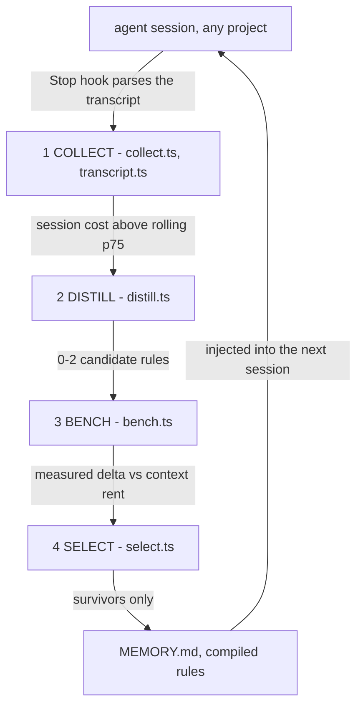

# token-warden

[](https://github.com/vukkt/token-warden/actions/workflows/ci.yml)
[](LICENSE)
[](https://github.com/sponsors/vukkt)

**A Claude Code plugin that makes AI coding agents measurably cheaper — and refuses to claim
a saving it cannot prove.**

Every rule that wants space in an agent's context must demonstrate, on a frozen benchmark,
that it saves more tokens than it costs to carry. Rules that fail are evicted. Rules that
already passed are re-tested and evicted when they stop paying.

```text
  version    0.41.0            tests       1029 across 47 files
  released   46 versions       coverage    96.9% lines, CI-enforced floor
  built      2026-06 to now    source      38 modules, 12.7k lines
  license    MIT               test code   17.4k lines
```

---

## The problem

Agent "memory" is usually a text file of advice someone wrote once. Nobody measures whether
it helps. It costs tokens on every single call, forever, whether or not it works.

At team scale that is a real line item: a rule carried by four agents across a thousand
sessions a week is paid for a thousand times a week, silently. The question nobody was
answering is the obvious one — **does this rule actually pay for itself?**

token-warden answers it with a measurement, or refuses to answer.

---

## How it works


```mermaid
flowchart TD
    S["agent session, any project"]
    C["1 COLLECT - collect.ts, transcript.ts"]
    D["2 DISTILL - distill.ts"]
    B["3 BENCH - bench.ts"]
    SEL["4 SELECT - select.ts"]
    MEM["MEMORY.md, compiled rules"]

    S -->|Stop hook parses the transcript| C
    C -->|session cost above rolling p75| D
    D -->|0-2 candidate rules| B
    B -->|measured delta vs context rent| SEL
    SEL -->|survivors only| MEM
    MEM -->|injected into the next session| S
```

Stages 1 and 2 run automatically in the background. The collector lives in a `Stop` hook
under a hard sub-2-second budget and fails open — any error exits 0, so a session is never
blocked. Stages 3 and 4 are an explicit command, so token spend is always a decision the
operator makes.

---

## Results

Six candidate rules, measured on the `sql` agent across **397 headless benchmark runs**.
Read from the live ledger, not a simulation.

```text
  measured delta per candidate rule, tokens/run

          -10k      -5k     0      +5k     +10k
  rule 1    -9,215  ######################|
  rule 2    -6,134         ###############|
  rule 3      +622                        |#
  rule 4    +5,731                        |##############
  rule 5   +10,851                        |##########################
```

| Rule | Measured delta | Bar to clear | Outcome |
|---|---|---|---|
| 1 | -9,215 | 28 | evicted, negative on re-audit |
| 2 | -6,134 | 30 | evicted, negative |
| 3 | +622 | 57 | **kept** |
| 4 | +5,731 | 60 | **kept** |
| 5 | +10,851 | 30 | evicted, **uncertain** (SE 7,814) |
| 6 | -71,998 | 30 | evicted, quota-death artifact |

**Two of six survived.** The interesting row is 5: it measured +10,851 tokens saved per run,
362x the bar it needed to clear, and was still evicted — its standard error of 7,814 meant
the result could not be distinguished from noise. The system is built to refuse exactly that
number, because a measurement instrument that reports what you hope for is not an
instrument.

Row 6 is what a quota death looked like before the tool learned to recognize one. That
garbage verdict is why the environment-failure guard exists; today the same run records no
verdict at all.

---

## Economics

The two surviving rules save a combined **6,353 tokens per session**. At Claude Sonnet input
pricing that is **$0.019 per session** — trivial once, material at volume.

| Deployment | Sessions/week | Per year, 1 agent | Per year, 4 agents |
|---|---|---|---|
| Solo developer | 20 | $20 | $79 |
| Small team (5x) | 100 | $99 | $396 |
| Engineering org (50x) | 1,000 | $991 | $3,964 |
| Enterprise (250x) | 5,000 | $4,955 | $19,821 |
| Platform scale | 25,000 | $24,777 | $99,107 |

Roughly 0.33x on Haiku, 1.67x on Opus, 3.3x on Fable. Any row is reproducible with
`/warden-cost --project --sessions-per-week <n>`.

> These are benchmark measurements on a frozen fixture priced at the input rate, not
> observed invoices, and they assume rules of this size survive on your workload — which is
> the thing the tool measures rather than assumes. See *Limitations* below.

---

## Engineering

The measurement discipline is the product, so the codebase is held to it.

| | |
|---|---|
| **Tests** | 1029 across 47 files. 17.4k lines of test code against 12.7k of source. |
| **Coverage** | 96.9% lines, 96.0% statements, 97.1% functions, 89.1% branches, behind a ratcheted floor CI fails on. |
| **Pipeline** | Staged: quality gates test, fixture and coverage, which gate validate, which gates release. Actions SHA-pinned, least-privilege tokens, `npm ci`. |
| **Types** | Strict TypeScript with `noUncheckedIndexedAccess`. Zero `any`, zero `@ts-ignore`, zero non-null assertions across src and test. |
| **Data** | SQLite with 16 versioned migrations, applied transactionally under `BEGIN IMMEDIATE` so two concurrent processes cannot both apply one. |
| **Security** | Model-generated text is untrusted: validated at the boundary, sanitized before display (control, bidi and zero-width characters), and benchmarks run under scoped permissions, never `bypassPermissions`. |

Three decisions that show the standard better than the metrics do:

- **It measured its own false-positive rate and published the bad news.** A zero-token A/A
  harness run against real recorded data put the gate's false-positive rate at **8.8%**,
  against the ~2.5% a synthetic model had predicted. The larger number is the one in the
  docs.
- **It rejected one of its own features.** A tail-robust estimator looked like an
  improvement until calibration showed it *raised* the false-positive rate. It ships as an
  advisory flag and is kept out of the gate.
- **Refactors are proven, not asserted.** Extracting the statistics module was verified by
  fingerprinting 10,960 verdict-path outputs before and after across swept configuration —
  bit-identical, SHA-256 matched, before the change was committed.

---

## Timeline

| | |
|---|---|
| First commit | 2026-06-11 |
| Releases | 46 tagged versions across ~7 weeks |
| Current | v0.41.0 |
| Cadence | Ships behind a green pipeline; every release note names what is unproven |

Recent arc: variance-aware verdicts and Neyman allocation, empirical self-calibration, a
four-layer environment-failure abort validated against three real quota deaths,
distribution-weighted suites, bring-your-own-agent, then a repository-wide hardening pass
and a shared-module extraction.

---

## Limitations

Stated plainly, because the project's only real claim is that it does not overstate.

- **No rule distilled from day-to-day production work has yet survived the gate.** Survivors
  so far come from benchmark runs. Whether real workloads contain catchable, generalizable
  waste is the open question — `/warden-cohort` and `/warden-confirm` exist to answer it.
- The rule-compression experiment is **closed as unconfirmable**, not as a win: three token
  burns were each killed by quota exhaustion, and the effect is smaller than the suite's own
  noise at any affordable run count.
- The shipped agents are already well optimized, so the largest measured savings come from a
  deliberately naive positive control built to prove the engine detects a real effect.

---

## Try it

Node.js 22+, Claude Code v2.1+.

```text
/plugin marketplace add vukkt/token-warden
/plugin install token-warden@vukkt-plugins
```

Sessions are measured immediately; `/warden-status` shows the data. To run the part that
saves tokens:

```bash
git clone https://github.com/vukkt/token-warden.git && cd token-warden && npm install
npm run bench -- --agent all      # freeze baselines, once
npx tsx src/select.ts --agent sql # measure pending candidates
```

The bench step spends real tokens — `/warden-power` sizes it first, for free. 20 commands
cover reporting, cost, A/B benchmarking of models and prompts, governance and team sharing.

---

[ARCHITECTURE.md](ARCHITECTURE.md) — module map and data model ·
[DECISIONS.md](DECISIONS.md) — every non-obvious choice and why ·
[FINDINGS.md](FINDINGS.md) — experiments, including the failures ·
[ROADMAP.md](ROADMAP.md) ·
[CONTRIBUTING.md](CONTRIBUTING.md) ·
[SECURITY.md](SECURITY.md)

MIT.
