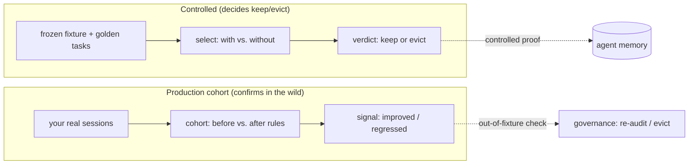
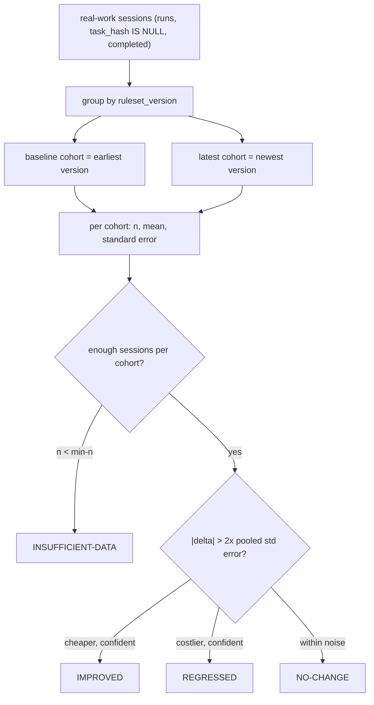

# Production-cohort validation

**Status:** shipped in v0.20.0 (`src/cohort.ts`, `/warden-cohort`). This note is
the design and rationale; for the system overview see
[ARCHITECTURE.md](../ARCHITECTURE.md).

## Why this exists

The frozen-fixture benchmark (`/warden-select`) is a *controlled* experiment: it
runs golden tasks on a fixed repo, with and without a rule, and proves the rule
saves tokens on that repeatable workload. That is the right way to *decide* keep
vs. evict — but it has two limits:

1. **It only covers the bundled agents and tasks.** It can't tell you whether a
   rule helps *your* real repositories.
2. **It costs extra tokens**, and detecting a small effect through run-to-run
   noise costs tokens proportional to `(noise / effect)²` — which can exceed the
   saving itself.

Production-cohort validation is the complementary, **out-of-fixture** signal. It
asks a different question — *did rules actually make real work cheaper?* — using
sessions you already ran, so it spends **no extra tokens**.

## The two validation modes are complementary



The fixture benchmark stays the gate for *admitting* a rule. The cohort signal is
the feedback loop that catches a rule which looked good on the fixture but isn't
paying off — or is hurting — on real work.

## How it works

Every completed real-work session is already recorded in `runs` (token totals,
the `ruleset_version` active at the time, `task_hash IS NULL` marks real work).
Cohort validation reads the **per-session totals** (not pre-averaged), groups
them by ruleset version, and compares the earliest cohort (before rules) against
the latest (after rules).



### The statistics

For each cohort (one ruleset version) we compute, from its per-session totals:

- `n` — completed sessions
- `mean` — average tokens per session
- `stdErr = stdDev / sqrt(n)` — standard error of the mean (null when `n < 2`)

The verdict compares baseline vs. latest:

- `delta = baseline.mean - latest.mean` (positive means real work got cheaper)
- `pooledStdErr = sqrt(baseline.stdErr² + latest.stdErr²)`
- **confident** when `|delta| > 2 × pooledStdErr` (~95%)
- **IMPROVED** if confident and cheaper, **REGRESSED** if confident and costlier,
  **NO-CHANGE** otherwise, **INSUFFICIENT-DATA** if either cohort is below `min-n`
  (default 5) or there is only one ruleset version.

### Worked example

```
cohort validation — sql
  v0: n=8  mean=50,400  ±1,050
  v1: n=7  mean=41,900  ±1,200
  v0 -> v1: +8,500 tok/session (-16.9%)
  verdict: IMPROVED — |8,500| > 2x pooled stderr 1,595
```

## What it is not — the honest caveat

This is **observational, not a controlled experiment.** Real sessions are not
task-controlled the way golden tasks are: the work in the `v0` cohort may differ
from the work in `v1`, so a difference can come from the *task mix* changing, not
the rules. Two mitigations:

- `--project <path>` narrows the comparison to one repository, where the task mix
  is more stable.
- The verdict is a **signal that feeds governance** (re-audit, eviction), never
  the sole authority to admit a rule — that remains the controlled fixture
  benchmark.

Treat IMPROVED as "real work corroborates the fixture," and REGRESSED as "the
fixture and reality disagree — re-audit this agent's rules."

## Where it fits next

The cohort verdict is the production half of the **rule governance and
falsification** roadmap theme (see the README roadmap): wiring REGRESSED into
automatic re-audit/eviction is the natural follow-on, so a rule that stops paying
off in production is dropped without waiting for the next manual fixture run.

## Usage

```bash
npx tsx src/cohort.ts                 # every domain agent
npx tsx src/cohort.ts --agent sql     # one agent
npx tsx src/cohort.ts --agent sql --project /path/to/repo --min-n 8
npx tsx src/cohort.ts --json          # machine-readable
```

Or the `/warden-cohort` slash command. Read-only; spends no tokens.
